# Adaptive-P Sampler - Complete Documentation

> **Compiled on 2026-01-01 15:20:52**
>
> This document has been compiled from individual sections.
> Images are referenced relative to the 'charts' folder.

---

## Table of Contents

- [Abstract](#abstract)
- [1. Introduction](#1-introduction)
- [2. Related Work and Comparative Analysis](#2-related-work-and-comparative-analysis)
- [3. The Adaptive-P Algorithm](#3-the-adaptive-p-algorithm)
- [4. Design Justification](#4-design-justification)
- [5. Parameters](#5-parameters)
- [6. Integration and Sampler Chain](#6-integration-and-sampler-chain)
- [7. Empirical Validation](#7-empirical-validation)
- [8. Implementation Reference](#8-implementation-reference)
- [9. Conclusion](#9-conclusion)
- [Appendix: Sample Outputs](#appendix-sample-outputs)

---

# Abstract

We present Adaptive-P, an alternative sampling method for autoregressive language models that targets a specific probability range rather than truncating or uniformly scaling the token distribution. Unlike temperature sampling (which affects all tokens equally) or truncation methods like top-p and min-p (which make binary include/exclude decisions), Adaptive-P applies a continuous transformation that preferentially selects tokens near a user-specified target probability.

The method maintains a weighted moving average of previously selected token probabilities and dynamically adjusts its targeting to achieve this average over time. When recent selections skew toward high-probability tokens, the sampler compensates by targeting lower probabilities on subsequent steps, and vice versa. This adaptive behavior breaks the high-confidence token chains that produce repetitive, generic output—a phenomenon practitioners often call "slop".

This document presents:
- A probability-targeting paradigm as an alternative to truncation-based sampling
- An unbounded quadratic transformation that handles sparse, clustered real-world token distributions without probability pile-up
- Adaptive adjustment that prevents both monotony (always selecting high-probability tokens) and chaos (random low-quality selections)
- Clean integration with existing sampler chains, complementing min-p as a guardrail

Empirical evaluation across multiple models demonstrates that Adaptive-P successfully targets user-specified probability ranges while maintaining output coherence. In testing, in preliminary testing, the same target parameter produced similar selection patterns across tested models (GLM-4.x, Mistral, Cydonia), making it a practical tool for controlling the creativity-coherence tradeoff in text generation. The method is intended for creative applications where output diversity is valued over predictability; standard likelihood-based metrics are not applicable.

---

# 1. Introduction

## 1.1 The Problem: High-Confidence Token Chains

Modern large language models produce remarkably fluent text, but this fluency often comes at the cost of creativity and variety. The underlying issue is what we term "high-confidence token chains"—sequences where each token's selection reinforces the next high-probability choice, creating a self-perpetuating cycle of predictable output.

Consider a model continuing "The detective examined the..." The most probable next token is likely "evidence," "body," or "scene." Once "scene" is selected, "of the crime" becomes extremely likely. The model locks onto familiar narrative grooves, and nothing in standard sampling breaks this chain.

This behavior manifests in practical terms as:
- **Repetitive phrasing**: The same sentence structures and word choices appearing across generations
- **Generic descriptions**: "The room was dimly lit" instead of more specific, evocative language  
- **Predictable narratives**: Story beats following the most common patterns from training data
- **Formulaic output**: Text that feels AI-generated—technically correct but lacking authentic voice (sometimes called "slop" in practitioner communities)

The root cause isn't the model's knowledge—modern LLMs encode vast linguistic diversity. The problem is that standard sampling methods don't provide a mechanism to *access* that diversity in a controlled way.

## 1.2 Why Existing Approaches Fall Short

Current sampling methods fall into two broad categories, neither of which solves the high-confidence chain problem:

**Scaling approaches** (temperature) multiply all logits by a constant factor. This uniformly spreads probability mass but provides no way to *target* a specific probability range. High temperature makes everything more random, including garbage tokens. Low temperature makes everything more deterministic, reinforcing the chain problem.

**Truncation approaches** (top-k, top-p, min-p) remove tokens below some threshold and renormalize. This is a binary decision—tokens are either in the candidate pool or excluded entirely. Within the remaining pool, there's no preference mechanism. If the top token has 0.6 probability after truncation, it will be selected roughly 60% of the time regardless of whether the user wants more varied output.

Neither approach asks the question we actually want to answer: "Can we preferentially select tokens at a specific probability level?"

**Example:** Consider three tokens with probabilities 0.7, 0.2, and 0.1:
- **Temperature 1.5:** Flattens to roughly 0.5, 0.3, 0.2. The top token still dominates; low tokens get a boost but remain minority choices.
- **Top-P 0.9:** Keeps all three (cumulative 1.0 > 0.9). No preference within the set—the 0.7 token is still selected 70% of the time.
- **Min-P 0.15:** Keeps the 0.7 and 0.2 tokens. Again, no preference—just truncation.

These methods are designed for different goals—none are intended to express preferences like "prefer the 0.2 token over the 0.7 token."

## 1.3 The Adaptive-P Solution

Adaptive-P takes a fundamentally different approach: rather than scaling or truncating, it *reshapes* the probability distribution to favor tokens near a target probability.

The core insight is that probability targeting can be framed as a distance metric. For each token, we compute how far its probability lies from the target, then transform its logit based on that distance. Tokens near the target receive high logits; distant tokens are suppressed.

This creates several desirable properties:

1. **Controlled creativity**: A target of 0.5 means the sampler prefers tokens that the model considers "plausible but not dominant." A target of 0.3 encourages more surprising choices. A target of 0.7 stays closer to the model's top predictions.

2. **Adaptive adjustment**: The sampler tracks which probabilities have been selected recently. If recent selections skewed high, it compensates by targeting lower on the next step. This prevents both stuck-in-a-rut determinism and chaotic randomness.

3. **Chain breaking**: High-confidence chains are disrupted because the sampler actively resists selecting 0.9+ probability tokens repeatedly. The first high-confidence token in a potential chain shifts the target downward, making alternatives more attractive for subsequent tokens.

4. **Consistent behavior**: Unlike temperature (where the effect depends heavily on the input distribution's shape), the same target parameter produces similar selection patterns across different models and contexts.

[!NOTE]
Intended Use Case: Adaptive-P is designed for creative text generation—fiction, roleplay, brainstorming—where predictability is undesirable. It is not intended for factual Q&A, summarization, or tasks where accuracy matters more than variety. Evaluation metrics throughout this paper reflect this scope: we measure whether the sampler hits its probability targets, not whether output matches predictable references.

---

# 2. Related Work and Comparative Analysis

This section examines existing sampling methods, their limitations, and how Adaptive-P addresses these gaps. For each method, we analyze both theoretical properties and practical behavior on real token distributions.

## 2.1 Temperature Sampling

Temperature scaling is the most widely used sampling parameter. It divides all logits by a temperature value T before softmax:

```
logit_scaled = logit / T
```

**Properties:**
- T < 1.0: Sharpens the distribution, making high-probability tokens more dominant
- T = 1.0: No change from model's natural distribution  
- T > 1.0: Flattens the distribution, spreading probability mass more evenly

**Limitations:**

Temperature affects all tokens uniformly. It cannot express preferences like "I want mid-range tokens, not the top token or garbage tokens." When you increase temperature to encourage variety, you also increase the probability of low-quality tokens. When you decrease it for coherence, you reinforce the high-confidence chains.

The effect is also highly dependent on the input distribution's shape. Applying T=1.2 to a peaked distribution (one token at 0.8) produces a very different result than applying it to a flat distribution (many tokens around 0.1). This makes temperature difficult to tune consistently across different models and contexts.

<table>
<tr>
<td width="50%">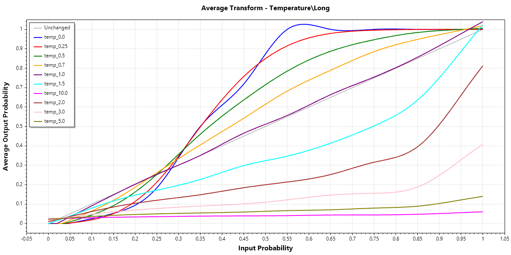<br><em>Temperature uniformly scales: low temp favors high-p, high temp flattens everything.</em></td>
<td width="50%">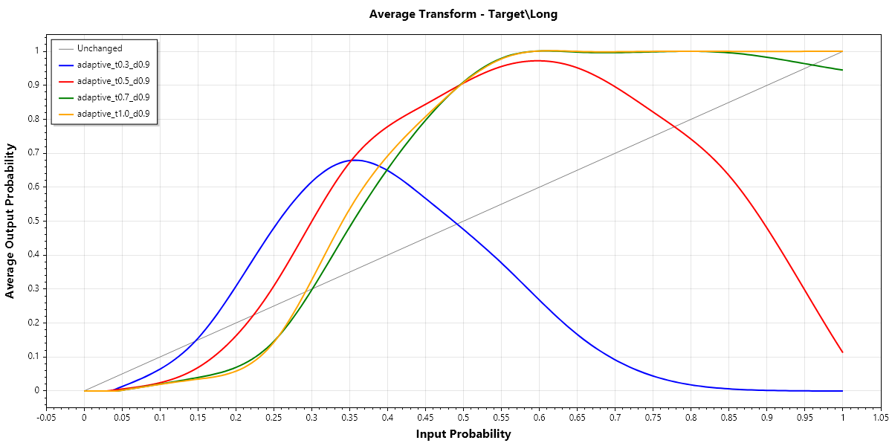<br><em>Adaptive-P creates a controllable peak at the target probability.</em></td>
</tr>
</table>

## 2.2 Top-K Sampling

Top-K sampling keeps only the K highest-probability tokens and renormalizes.

**Properties:**
- Simple threshold: exactly K tokens remain
- Removes low-probability mass entirely

**Limitations:**

The fixed K value doesn't adapt to distribution shape. For a peaked distribution where the top 3 tokens have 0.95 cumulative probability, K=50 is wasteful—you're including 47 tokens that will rarely be selected anyway. For a flat distribution where probability is spread across hundreds of reasonable options, K=50 may be too restrictive.

More fundamentally, Top-K answers "which tokens are most likely?" but provides no mechanism for preferring specific probability ranges within the kept set.

## 2.3 Top-P (Nucleus Sampling)

Top-P keeps the smallest set of tokens whose cumulative probability exceeds threshold P.

**Properties:**
- Adaptive threshold: includes more tokens when distribution is flat
- Commonly used default: P = 0.9 or 0.95

**Limitations:**

Like Top-K, Top-P is a truncation method. It makes binary include/exclude decisions without expressing preferences within the kept set. A token at 0.4 probability and a token at 0.05 probability are treated identically—both are "in" if they fall within the nucleus.

Top-P also doesn't specifically encourage mid-range selection. If the distribution has a clear winner, that winner will dominate even with Top-P=0.9.

## 2.4 Min-P

Min-P removes tokens whose probability falls below a threshold relative to the most probable token:

```
threshold = max_probability * min_p
```

**Properties:**
- Scales with distribution shape: peaked distributions have higher absolute thresholds
- Effective garbage removal: tokens far below the leader are excluded
- Commonly used values: min_p = 0.05 to 0.1

**Strengths:**

Min-P is excellent at what it does: removing tokens that should never be selected regardless of other sampling decisions. It prevents the pathological case where temperature increase allows garbage tokens to accumulate probability.

**Relationship to Adaptive-P:**

Min-P and Adaptive-P are complementary. Min-P serves as a guardrail that cleans the candidate pool. Adaptive-P then operates on the remaining quality candidates, applying preference among them.

The samples in this paper show tokens already filtered to p > 0.01—that's min-p at work. Adaptive-P assumes this cleanup has happened and focuses on the selection decision among viable candidates.

### Min-P as Guardrail: Text Comparison

The stabilizing effect of min-p on low-target generations is best demonstrated through reading. With target 0.1 (maximum creativity), Adaptive-P aggressively prefers the lowest-probability tokens. Without min-p, garbage tokens become valid selections. With min-p, only quality candidates remain.

**Prompt:** *"Write me a three paragraph horror story about a haunted bath-house written in the first person"*

**[Target 0.1 WITHOUT Min-P](#sample-target-0-no-minp)** — Chaotic, incoherent output as garbage tokens are selected

**[Target 0.1 WITH Min-P 0.05](#sample-target-0-with-minp)** — Coherent but highly creative output; min-p removes garbage while Adaptive-P explores low-probability quality tokens

## 2.5 XTC (eXclude Top Choices)

XTC randomly removes high-probability tokens to force consideration of alternatives.

**Mechanism:**
1. Identify tokens above a probability threshold
2. Randomly exclude some portion of these top tokens
3. Renormalize and sample from remaining candidates

**Observed Limitation: Renormalization**

When XTC removes top tokens, the probability mass must go somewhere. Standard implementations renormalize across all remaining tokens—including garbage tokens at the far tail.

This causes **fat tail accumulation**: removing a 0.6 probability token and redistributing to 1000 remaining tokens gives each an extra 0.0006. But those 1000 tail tokens, collectively, now have significant mass. The probability of selecting a low-quality token increases substantially.

This problem can compound when XTC users typically increase the exclusion probability to get "more creative" output. But more exclusion means more probability mass dumped into the garbage tail.

**Practical Issues:**

XTC can produce unpredictable results. Some generations are excellent—the forced alternative selection leads to interesting choices. Others are incoherent—garbage tokens were selected due to accumulated tail probability.

The RNG dependence also means that the same prompt with the same settings can produce wildly different quality outputs. Some users describe "never knowing what you were going to get."

<table>
<tr>
<td width="50%"><strong>XTC Redistribution:</strong><br>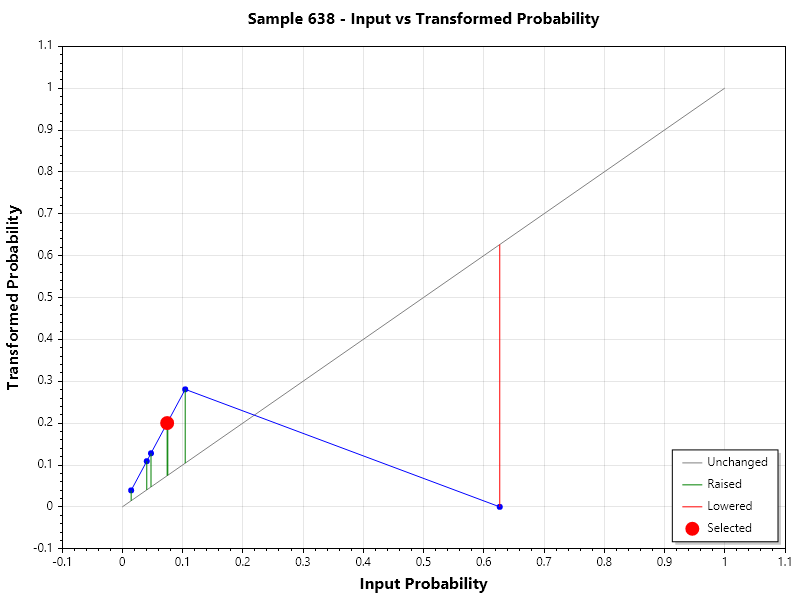<br><em>XTC: All tail tokens get boosted (green lines up).</em></td>
<td width="50%"><strong>Adaptive-P:</strong><br>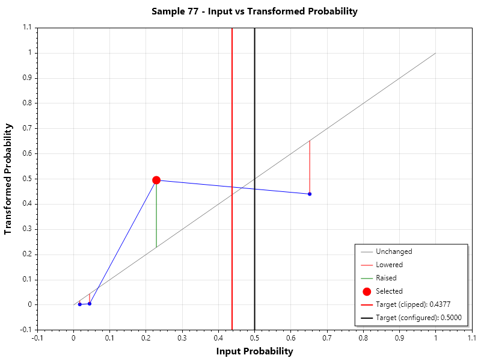<br><em>Adaptive-P: Only near-target tokens boosted; tail suppressed.</em></td>
</tr>
</table>

## 2.6 Mirostat

Mirostat was the original inspiration for Adaptive-P. It targets a specific perplexity level by dynamically adjusting Top-K:

**Mechanism:**
1. Compute perplexity of current selection
2. If perplexity is below target, increase K (allow more options)
3. If perplexity is above target, decrease K (restrict options)

**Observed Behavior with Modern Models:**

Mirostat was designed when model probability distributions tended to be broader. A Top-K adjustment from 50 to 100 meaningfully changed the candidate pool.

In our testing, modern models—especially those trained with RLHF—often produce sharper distributions. The top 2-3 tokens often hold 90%+ of the probability mass. Adjusting Top-K from 50 to 100,000 often selects the same tokens because nothing else has meaningful probability.

The samples in this paper illustrate this reality: most token selections have only 2-5 viable candidates after min-p filtering. Top-K adjustment cannot create variety that doesn't exist in the distribution.

Adaptive-P addresses this by operating on probabilities directly, not on rank. It can boost a 0.1 probability token's chances relative to a 0.8 probability token, which Top-K adjustment cannot accomplish.

## 2.7 Why Adaptive-P is Different: Selective Redistribution

The key differentiator is **selective redistribution**. When Adaptive-P transforms logits, it applies changes as a function of distance from target probability:

- Tokens near target: receive high logits, compete for selection
- Tokens moderately far: receive lower logits, still contribute
- Tokens very far: receive unboundedly negative logits, effectively excluded

This is fundamentally different from:
- Temperature (uniform scaling—all tokens affected equally)
- Truncation (binary—tokens are in or out)
- XTC (mass redistribution—excluded probability goes everywhere)

**Handling Real Distributions:**

Real token distributions after min-p rarely resemble smooth curves. They typically show:
- A single 100% token (forced choice—no alternatives exist)
- One high token + sparse low cluster (one clear option, some distant alternatives)
- 2-3 mid-range candidates + low cluster with gap (competitive choice with tail)
- Many low-probability tokens with no clear leader (creative opportunity)

Adaptive-P's transformation handles each case appropriately. The unbounded negative logits prevent clustered low tokens from accumulating probability. The quadratic core provides fine differentiation among close competitors.

**Why renormalization fails (the XTC problem):**

When XTC removes a 0.6 probability token, that 0.6 must go somewhere. With renormalization across 100 remaining tokens:
- Each gets +0.006 added probability
- A garbage token that was 0.001 becomes 0.007—a 7× increase
- The combined tail of 90 garbage tokens goes from ~0.05 total to ~0.60 total

This "fat tail" effect means that after XTC removes the top choice, you're nearly as likely to get garbage as to get a coherent alternative. Users experience this as generation "flip-flopping" between reasonable output and nonsense—never knowing which they'll get.

The XTC vs. Adaptive-P comparison charts in Section 2.5 demonstrate this contrast: XTC's renormalization boosts all tail tokens proportionally, while Adaptive-P concentrates probability on near-target tokens and suppresses the tail.


---

# 3. The Adaptive-P Algorithm

This section presents the complete algorithm, starting with conceptual foundations and building to implementation details.

## 3.1 Core Concept: Probability Targeting

The fundamental question Adaptive-P answers is not "which tokens are most likely?" but rather "which tokens occupy a specific probability range?"

Consider a token distribution where:
- Token A has probability 0.60
- Token B has probability 0.25  
- Token C has probability 0.10
- Token D has probability 0.05

Standard sampling will select Token A roughly 60% of the time. But what if we want to encourage selection of tokens in the 0.2–0.4 probability range—tokens the model considers "plausible but not dominant"?

Adaptive-P addresses this by applying a bell-curve transformation centered on the target probability. If target is 0.3, Token B (at 0.25) becomes favored over Token A (at 0.60), even though Token A started with higher probability.

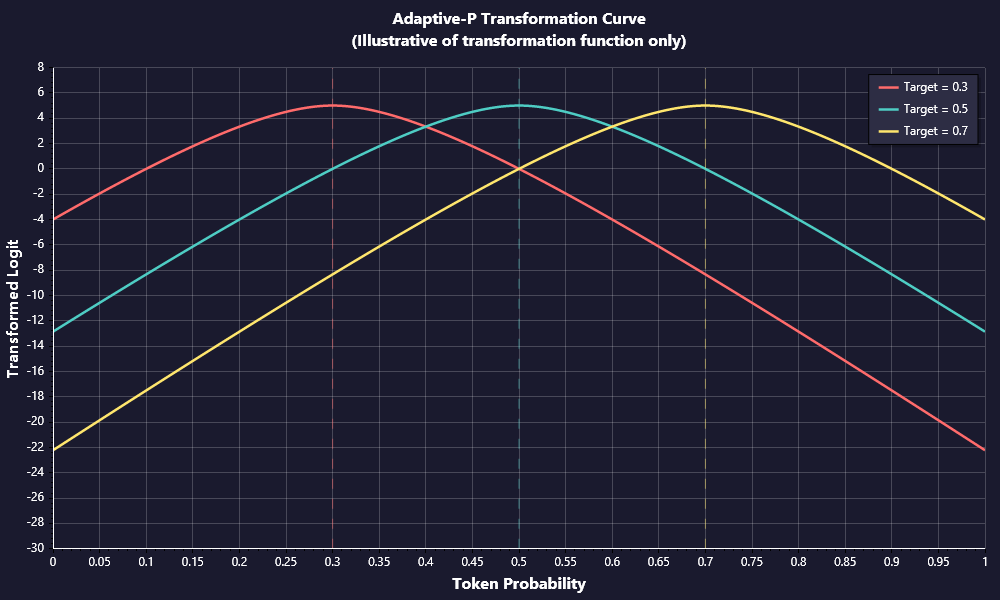

*Illustrative of transformation function only—real token distributions are sparse/clustered.*

## 3.2 Real Distribution Behavior

In practice, candidate pools after min-p filtering show characteristic patterns rather than smooth distributions. Understanding these patterns is essential to understanding why Adaptive-P's specific transformation design matters.

### Pattern A: Forced Choice

**Example:** A distribution with a single token at probability 1.0.

When only one token survives min-p filtering, the sampler has no choice. Adaptive-P passes through—the single token is selected regardless of its probability relative to target.

**Implication:** Adaptive-P cannot create choices that don't exist. It operates on the candidates provided by earlier pipeline stages.

**Effect on adaptive target:** The forced selection (probability 1.0) is recorded in history. If the configured target is 0.5, this high selection pushes the calculated target lower on subsequent steps—the sampler will compensate by preferring lower-probability options when choices become available again.

### Pattern B: Binary Split

**Example:** Two candidates—one at 0.94, one at 0.06.

Two candidates with a large probability gap. Both are viable (passed min-p), but one strongly dominates.

**Effect:** If target is 0.5, neither token is close. The 0.94 token is 0.44 away from target; the 0.06 token is also 0.44 away. Because they're nearly equidistant from target, the transformation produces nearly equal output probabilities—despite starting with a 94% vs 6% split. The underdog's post-transform probability rises to roughly 50%.

This is the chain-breaking mechanism in action. A high-confidence token followed by another high-confidence prediction gets disrupted because the target-adjustment favors alternatives.

### Pattern C: Clustered Tail

**Example:** One token at 0.30, plus 20+ tokens clustered between 0.01–0.10.

One mid-range leader with a cluster of low-probability alternatives. This is where the transformation's tail behavior matters most.

**The clustering problem:** If transformation applies a floor (e.g., minimum logit of 0), all 20 tail tokens hit that floor after softmax. Each gets exp(0) = 1.0 relative score. Twenty tokens times 1.0 = 20.0 cumulative score. The leader at 0.30 might have logit 5.0, so exp(5.0) ≈ 148. Ratio: 148 / (148 + 20) ≈ 88% for leader, 12% for entire tail.

That 12% split across 20 tokens seems okay, but imagine 100 tail tokens: now it's 148 / (148 + 100) ≈ 60% leader, 40% tail—significant garbage probability.

**Adaptive-P's solution:** Unbounded negative logits. Each additional unit of distance from target produces another unit of negative logit, which translates to another order of magnitude less probability after softmax. The cluster never accumulates mass.

### Pattern D: Competitive Mid-Range

**Example from samples:** "serene/river" → `token 21748: 0.469` vs `token 14785: 0.427`

Two tokens close in probability, both reasonably near target. This is where the quadratic core of the transformation matters.

**Effect:** The quadratic shape provides fine differentiation between close candidates. A token at distance 0.02 from target gets a noticeably different logit than one at distance 0.08, allowing the sampler to express graduated preference rather than treating all near-target tokens identically.

<table>
<tr>
<td width="50%">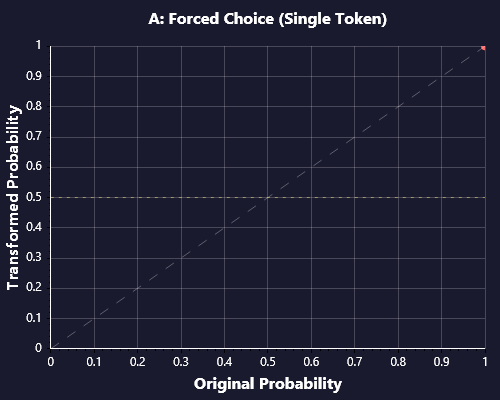<br><em>Pattern A: Single token forced selection</em></td>
<td width="50%">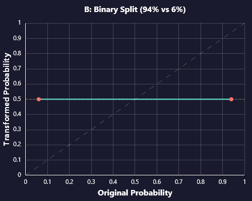<br><em>Pattern B: Binary split (94% vs 6%)</em></td>
</tr>
<tr>
<td width="50%">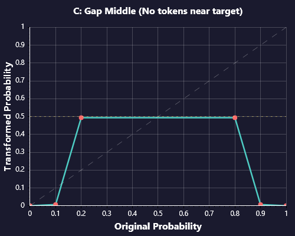<br><em>Pattern C: Gap in middle (no tokens near target)</em></td>
<td width="50%">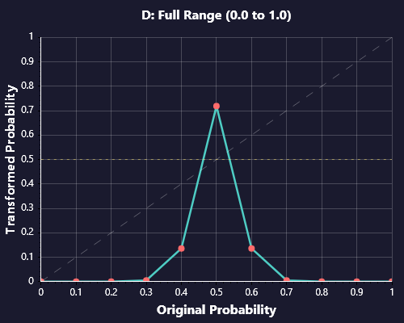<br><em>Pattern D: Full range (0.0 to 1.0)</em></td>
</tr>
</table>

*Line graphs show original probability (x-axis) vs transformed probability (y-axis). Dashed diagonal = no change; dotted horizontal = target (0.5).*

## 3.3 Configured Target vs. Calculated Target

Adaptive-P maintains a distinction between what the user requests and what the algorithm targets on each step:

- **Configured Target:** User-specified desired average probability (e.g., 0.5)
- **Calculated Target:** Per-token adjusted value based on selection history

The calculated target adapts based on a weighted moving average of previously selected token probabilities:

```
weighted_average = weighted_sum / total_weight
calculated_target = 2.0 × configured_target − weighted_average
```

**Intuition:** If recent selections averaged 0.6 probability but the user wants 0.5, the calculated target drops to 0.4 to compensate. The algorithm "aims past" the configured target to pull the average back toward it.

**In practice:** Calculated targets typically vary by about 2% around the configured target (e.g., 0.48–0.52 when configured at 0.5). This small variation shows the adaptation in action—compensating for natural selection variance to maintain the desired average. See Section 6.2 for charts showing this behavior at different decay values.

The calculated target is clamped to [0.0, 1.0] before use. Extreme historical selections can push the raw calculated value outside this range, but the clamping ensures the transformation remains well-defined.

> [!NOTE]
> Theoretically, an unclamped target could produce stronger logit differentiation—tokens within the [0,1] range would have more extreme logit differences due to greater distance from the unclamped value. In practice this provides little benefit: high-probability tokens can't cluster (there's only so much probability to go around), and low-probability tokens are already so close together in probability space as to be effectively indistinguishable.

## 3.4 The Logit Transformation

The heart of Adaptive-P is a transformation applied to each token's logit based on its probability's distance from the calculated target:

```cpp
float dist = std::abs((cur_p->data[i].p - adapted_target) * INV_WIDTH);
cur_p->data[i].logit = PEAK_LOGIT_VALUE - SHARPNESS * dist * dist / (1.0f + dist);
```

Breaking this down:

1. **Distance calculation:** `|probability - target| × INV_WIDTH`
   - Absolute distance from target, scaled by inverse distribution width
   - INV_WIDTH (1/0.2 = 5.0) amplifies distance for sharper discrimination

2. **Transformation:** `PEAK − SHARPNESS × dist² / (1 + dist)`
   - PEAK_LOGIT_VALUE (5.0): Maximum logit for tokens exactly at target
   - SHARPNESS (10.0): Controls curve steepness
   - The `dist² / (1 + dist)` term is the key: quadratic near zero, linear at distance

**Why this specific form?**

The `dist² / (1 + dist)` function has critical properties:

- **Near target (dist → 0):** Behaves like `dist²` (quadratic). Small differences in distance produce proportionally small differences in logit. This allows fine discrimination among close competitors.

- **Far from target (dist → ∞):** Behaves like `dist` (linear). Each additional unit of distance subtracts another unit from the logit. This is the "unbounded negative" property that prevents tail accumulation.

- **Transition region:** Smooth interpolation between behaviors. No discontinuities or kinks.

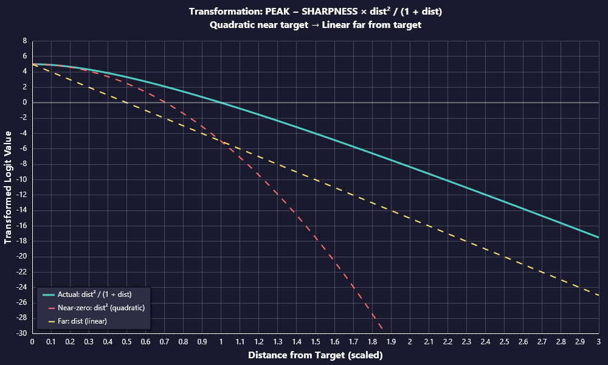

**Why not a floor-based transformation?**

A transformation with a minimum logit floor (e.g., one that asymptotically approaches zero) would cause all distant tokens to converge toward the same value, enabling the cluster accumulation problem described next.

## 3.5 Why Unbounded Negative Logits Matter

This section addresses the clustering problem in detail, as it's the key insight that drove the algorithm design.

**The setup:** Consider a distribution with 26 candidates ranging from 0.01 to 0.11 probability, none close to target 0.5.

**With a logit floor (bounded transformation):**
- All 26 tokens are far from target
- All receive approximately the minimum logit (let's say 0.0)
- After softmax: each gets exp(0) = 1.0 relative weight
- Total weight: 26.0
- Each token probability: 1/26 ≈ 3.8%

**With unbounded negative (Adaptive-P):**
- Closest token (0.11 probability) gets logit ≈ 3.0
- Next closest gets logit ≈ 2.5
- Distant tokens get logits of -5, -10, -15...
- After softmax: exp(3.0) ≈ 20, exp(2.5) ≈ 12, exp(-10) ≈ 0.00005
- Distant tokens contribute essentially zero probability

The practical difference:
- Floor-based: 26 tokens share probability approximately evenly
- Adaptive-P: Top 2-3 tokens dominate; rest are effectively excluded

This is the "selective redistribution" property. Probability doesn't flow uniformly to all candidates—it concentrates on those closest to target.

The XTC comparison charts in Section 2.5 illustrate this directly: XTC's renormalization boosts all tail tokens proportionally (green lines up), while Adaptive-P concentrates probability on near-target tokens and suppresses the tail (red lines down).

## 3.6 Softmax Normalization

The transformation outputs raw logit values. Softmax converts these to probabilities:

```
probability[i] = exp(logit[i]) / Σ exp(logit[j])
```

**Key property:** Relative differences between logits matter, not absolute values. Adding a constant C to all logits doesn't change probabilities:

```
exp(logit + C) / Σ exp(logit_j + C)  =  exp(C) × exp(logit) / (exp(C) × Σ exp(logit_j))  =  exp(logit) / Σ exp(logit_j)
```

The exp(C) terms cancel out.

This means PEAK_LOGIT_VALUE (5.0) is somewhat arbitrary—what matters is the *difference* between peak and suppressed logits.

**Interaction with tail behavior:**

Softmax's exponential nature amplifies the unbounded negative property. A logit difference of 10 produces a probability ratio of exp(10) ≈ 22,000. Very distant tokens become negligible contributors even without explicit removal.

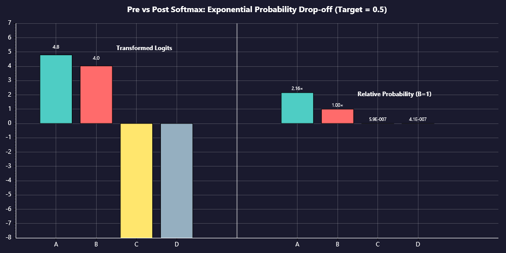

## 3.7 History State and Initialization

Adaptive-P maintains two state variables across token selections:

- **weighted_sum:** Running sum of selected token probabilities, decayed
- **total_weight:** Running sum of weight values, decayed

Updated after each selection:
```cpp
weighted_sum = original_probs[selected_idx] + decay × weighted_sum
total_weight = 1.0 + decay × total_weight
```

**The initialization problem:**

If weighted_sum and total_weight start at 0, the first calculated target becomes:
```
calculated_target = 2.0 × target − (0 / 0)  // undefined!
```

The code handles the 0/0 case by using the configured target directly. But this creates a transient: early selections have no history to compensate, so the sampler behaves differently during warmup.

**Correct initialization:**

Initialize as if the configured target had already been achieved:
```cpp
weighted_sum = target / (1.0 - decay)
total_weight = 1.0 / (1.0 - decay)
```

For target=0.5, decay=0.9:
- weighted_sum = 0.5 / 0.1 = 5.0
- total_weight = 1.0 / 0.1 = 10.0
- weighted_average = 5.0 / 10.0 = 0.5 ✓

This primes the history as if infinitely many tokens at the target probability had been selected, providing stable behavior from the first token.

<table>
<tr>
<td width="50%"><strong>Bad initialization (naive):</strong><br>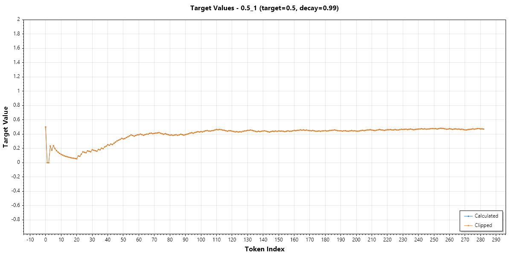<br><em>Naive init: Target drops to 0, takes ~100 tokens to recover.</em></td>
<td width="50%"><strong>Correct initialization:</strong><br>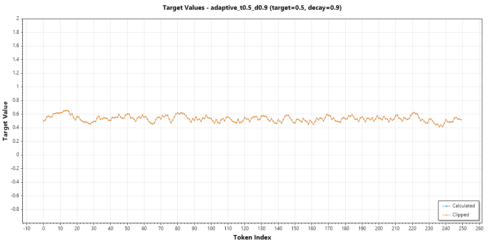<br><em>Correct init: Target stable from first token.</em></td>
</tr>
</table>


---

# 4. Design Rationale

This section explains why Adaptive-P uses its specific formulas and constants. Understanding these choices helps users predict behavior in edge cases and enables implementers to make informed modifications.

## 4.1 The Adaptive Target Formula

The core adaptive mechanism uses:

```
calculated_target = 2.0 × configured_target − weighted_average
```

**Why the 2.0 multiplier?**

The goal is for the *average* selected probability to converge to the configured target over time. If recent selections have averaged above target, we need to aim below target to compensate—and vice versa.

Consider the simplest case: if the next selection lands exactly at `calculated_target`, and we want the new average to equal `configured_target`:

```
(calculated_target + weighted_average) / 2 = configured_target
```

Solving for `calculated_target`:

```
calculated_target = 2 × configured_target − weighted_average
```

The actual implementation uses an exponentially-weighted moving average rather than a simple average, but the same principle applies. The 2.0 multiplier creates a control loop where overshooting in one direction produces proportional correction in the other.

**Boundary behavior:**

The calculated target is clamped to [0.0, 1.0] after computation. Without clamping, extreme historical averages could push the calculated target outside the valid probability range. For example, if `configured_target = 0.3` and `weighted_average = 0.8`, the raw calculated target would be `2(0.3) - 0.8 = -0.2`, which is clamped to 0.0.

## 4.2 The Transformation Function

The transformation converts probability-to-target distance into logits:

```
logit = PEAK − SHARPNESS × dist² / (1 + dist)
```

This specific form was selected after evaluating alternatives that failed in characteristic ways.

### Alternative 1: Lorentzian (Power Law)

```
logit = peak / (1 + dist²)
```

**Failure mode: Artificial floor**

The Lorentzian has a minimum value approaching zero but never reaching it. With typical constants, the minimum achievable logit is approximately 0.4, regardless of how far a token lies from target.

After softmax over 100 candidates, this floor means each garbage token retains ~1% probability. Collectively, distant tokens accumulate significant selection probability despite being semantically inappropriate. This is the same "fat tail" problem that affects XTC.

### Alternative 2: Gaussian

```
logit = peak × exp(−dist²)
```

**Failure mode: Cliff effect**

The Gaussian suppresses distant tokens effectively—too effectively. It creates a "cliff" where all tokens beyond a certain distance receive near-identical (negligible) logits.

When the target is 0.5 but only tokens at 0.1 and 0.2 probability are available, both are far from target. The Gaussian assigns them nearly equal selection probability despite 0.2 being objectively closer. The sampler loses the ability to express graduated preference among off-target candidates.

### Final Design: Adaptive Unbounded Quadratic

```
logit = PEAK − SHARPNESS × dist² / (1 + dist)
```

This function interpolates between two regimes:

**Near target (dist → 0):** The denominator approaches 1, yielding `PEAK − SHARPNESS × dist²`. Quadratic behavior preserves fine-grained differentiation among tokens close to target, similar to Gaussian.

**Far from target (dist → ∞):** The expression simplifies to approximately `PEAK − SHARPNESS × dist`. Linear decay ensures:
- Unbounded negative logits (no artificial floor)
- Proper suppression after softmax (each additional unit of distance costs another order of magnitude in probability)
- Maintained relative ordering (a token at distance 2 remains more probable than one at distance 3, even when both are far from target)

**Smooth transition:** The `(1 + dist)` denominator provides continuous interpolation without discontinuities or kinks.

## 4.3 Constant Selection

The three internal constants were empirically tuned across multiple models. This section documents the rationale and known limitations.

### PEAK_LOGIT_VALUE = 5.0

The peak value determines the maximum logit for tokens exactly at target. After softmax, this establishes probability ratios between on-target and off-target tokens.

At `PEAK = 5.0`, a token at target receives `exp(5.0) ≈ 148×` the probability weight of a token at logit 0. This provides strong differentiation without numerical instability.

- Lower values (e.g., 3.0) reduce differentiation, making the sampler less effective at targeting
- Higher values (e.g., 10.0) risk over-concentration on single tokens and potential overflow issues

### SHARPNESS = 10.0

Sharpness controls how quickly logits decay as tokens deviate from target. Higher values produce more aggressive suppression of off-target tokens.

The value 10.0 was selected to balance two failure modes:
- **Too low (e.g., 4.0):** Insufficient suppression of garbage tokens when min-p filtering is relaxed
- **Too high (e.g., 20.0):** Over-sensitivity to small probability differences, reducing effective candidate diversity

Sharpness interacts with the decay parameter: higher sharpness amplifies the effect of target adjustments, making low-decay configurations more volatile.

These values were tuned visually against sample candidate pool distributions—calibrated to produce reasonable drift among top candidates while preventing probability pile-up in the tail. They perform well across tested models but could likely be improved through systematic optimization.

### DISTRIBUTION_WIDTH = 0.2 (INV_WIDTH = 5.0)

Width normalizes the distance metric, defining what "near" and "far" mean in probability space.

With `WIDTH = 0.2`:
- A token 0.2 probability units from target has `dist = 1.0` (one "standard width")
- A token 0.4 probability units from target has `dist = 2.0`

This scaling produces intuitive relationships between target values and selection behavior. A target of 0.5 creates a preference band roughly spanning 0.3–0.7, with tokens outside this range progressively suppressed.

### Limitations of Constant Tuning

These constants were determined through iterative testing rather than systematic optimization:

- No grid search or formal hyperparameter tuning was conducted
- Testing concentrated on specific model families (GLM-4.x, Mistral, Cydonia)
- Interaction effects between constants were not formally characterized

The values work well across tested configurations but may benefit from adjustment for specific model architectures or use cases. The constants are defined as preprocessor macros to facilitate experimentation.

## 4.4 History Initialization

The weighted moving average requires careful initialization to avoid transient artifacts.

**The problem with naive initialization:**

Starting with `weighted_sum = 0` and `total_weight = 0` creates a degenerate first step. The code handles the 0/0 case by using configured target directly, but subsequent steps exhibit a characteristic "crash and recovery" pattern:

1. First selection (say, probability 0.8) enters an empty history
2. Weighted average immediately becomes 0.8
3. Calculated target swings to `2(0.5) - 0.8 = 0.2`
4. System spends many tokens recovering to equilibrium

**The correct initialization:**

Initialize as if the target had already been achieved at equilibrium:

```
weighted_sum = target / (1 − decay)
total_weight = 1 / (1 − decay)
```

**Derivation:** At equilibrium, the weighted average equals the target. For an exponentially-weighted sum with decay factor `d`, the sum of weights is the geometric series `1 + d + d² + ... = 1/(1-d)`. If every term in the weighted sum equals `target`, then `weighted_sum = target × 1/(1-d) = target/(1-d)`.

This initialization makes the first token behave identically to the hundredth token—no warmup period, no transient artifacts.

## 4.5 What Was Not Formally Tested

Transparency about evaluation limitations:

**No standard NLG metrics:** Evaluations used qualitative assessment ("does this read well?") rather than perplexity, MAUVE scores, or human preference ratings.

**No factorial design:** Interactions between target × decay × min-p × model architecture were not systematically characterized.

**Limited model coverage:** Limited model coverage: Most testing and all documentation samples used GLM-4.x. Qualitative testing on Mistral and Cydonia showed similar target-hitting behavior, but systematic cross-architecture comparison was not conducted. The "cross-model consistency" claim is based on observed selection patterns, not rigorous benchmarking.

**No ablation of adaptive component:** Direct quantitative comparison between static targeting (decay = 0) and adaptive targeting was not formally documented, though qualitative testing indicated static targeting produces oscillatory "fishtailing" behavior.

Community testing provided extensive qualitative feedback that informed the design, but this paper does not claim rigorous empirical validation by academic standards.

---

# 5. Parameters

Adaptive-P exposes two user-configurable parameters. This section details their effects, recommended ranges, and interaction with each other.

## 5.1 Target

**Range:** 0.0 to 1.0 (negative values disable the sampler)

**Default:** 0.5

**Effect:**

Target specifies the desired average probability of selected tokens. The sampler adjusts its per-step targeting to achieve this average over time.

| Target | Behavior | Use Case |
|--------|----------|----------|
| 0.3 | Prefers surprising, lower-probability tokens | Creative writing, brainstorming |
| 0.5 | Balanced—mid-range tokens preferred | General purpose |
| 0.7 | Stays closer to model's top predictions | Factual content, coherence-critical |
| 0.9+ | Nearly deterministic | When accuracy matters most |

### Generation Showcase

The following examples show the same prompt with different target values. Notice how lower targets produce more varied, surprising word choices while higher targets stay closer to conventional phrasing.

**Prompt:** *"Write me a three paragraph horror story about a haunted bath-house written in the first person"*

**[Target 0.3 (Creative)](#sample-target-0.3-sample)**
> *"My blood turns to icy slurry as a cold draft, utterly impossible in the humid heat, sweeps over the nape of my neck."*

**[Target 0.5 (Balanced)](#sample-target-0.5-sample)**
> *"The whispers started again, not from the pipes this time, but from the empty cubicles beside me, low and wet and sounding like voices drowning in deep water."*

**[Target 0.7 (Conservative)](#sample-target-0.7-sample)**
> *"A cold, bony touch sliding up my calf, leaving a trail of goosebites that felt like frost."*

**[Target 0.9 (Near-deterministic)](#sample-target-0.9-sample)**
> *"The water wasn't just haunted; it was alive, and it had decided I was its next meal."*

Notice how target 0.3 produces unusual imagery ("icy slurry"), while 0.9 gravitates toward polished, conventional phrasing. Target 0.5 balances creativity with coherence; 0.7 executes familiar horror tropes cleanly.

**Key property: Cross-model consistency**

Unlike temperature, which produces different effects depending on input distribution shape, preliminary testing suggests target produces similar selection patterns across architectures—though systematic cross-model comparison was not conducted (see Section 4.5).


**Intuition for parameter tuning:**

Users report that the target parameter feels intuitive once understood. "I want the model to pick tokens it's about 40% confident in" translates directly to target 0.4. This contrasts with temperature where "temperature 1.2" has no obvious semantic meaning.

## 5.2 Decay

**Range:** 0.0 to 0.99

**Default:** 0.9

**Effect:**

Decay controls how much historical selections influence the current calculated target. Higher decay means past selections have longer-lasting effect; lower decay makes the sampler more responsive to recent selections.

The decay value can be interpreted as "how many tokens back significantly influence the current step":

| Decay | Effective History Window |
|-------|-------------------------|
| 0.5 | ~2 tokens |
| 0.7 | ~3 tokens |
| 0.9 | ~10 tokens |
| 0.99 | ~100 tokens |

*Window approximates where historical weight drops below ~35% (decay^N ≈ 0.35).*

**Mathematical interpretation:**

The weight of a selection N steps ago is `decay^N`. At decay 0.9, a selection 10 steps ago has weight 0.9^10 ≈ 0.35 of the most recent selection. At decay 0.5, it has weight 0.5^10 ≈ 0.001—effectively forgotten.

**Effect on distribution shape:**

Higher decay produces sharper selection curves. With decay 0.99, the sampler tightly clusters selections around target because any deviation is strongly compensated. With decay 0.5, the sampler allows more per-step variance because it quickly "forgets" previous selections.

<table>
<tr>
<td width="50%"><br><em>Target effect: Lower targets peak earlier; higher targets stay closer to natural predictions.</em></td>
<td width="50%">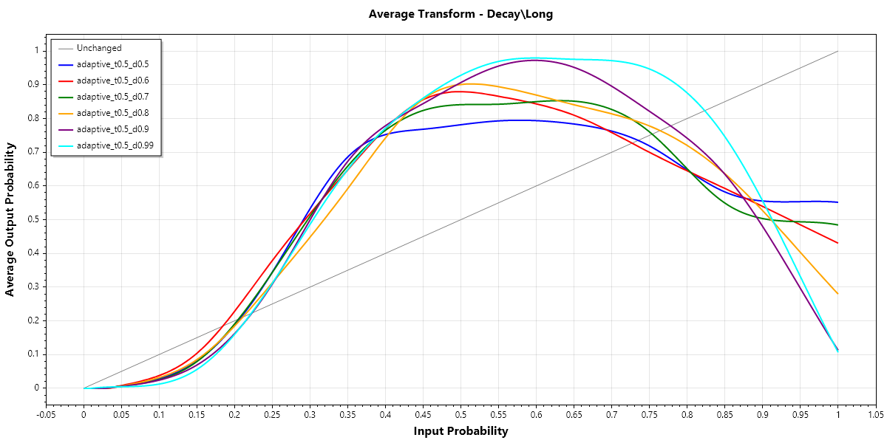<br><em>Decay effect: Higher decay produces sharper peaks around target.</em></td>
</tr>
</table>

**Interaction with target:**

Decay doesn't change *where* the sampler targets—that's controlled by target. Decay changes *how tightly* it maintains that target.

- High target + high decay: Consistently conservative selections
- High target + low decay: Variable, sometimes conservative
- Low target + high decay: Consistently creative selections
- Low target + low decay: Variable, sometimes creative

Most users keep decay at default (0.9) and adjust only target.

**Why decay is configurable:**

Although 0.9 works well for most cases, edge cases require adjustment:

- **Stubbornness (decay too high):** With decay 0.99, the sampler "remembers" history for ~100 tokens. If the first 50 tokens happened to be high-probability forced choices, the sampler stubbornly tries to compensate by targeting very low probabilities for the next 50—even when that's not ideal for the current context.

- **Fishtailing (decay too low):** With decay 0.5, the sampler reacts to only the last 2-3 tokens. After one high-probability selection, it swings hard toward low probability; after one low selection, it swings back. The output "fishtails" between extremes rather than finding a stable average.

- **Elasticity:** The ideal decay provides enough elasticity to return toward target without overcorrecting. Like a spring—too stiff and it fights every movement; too loose and it oscillates wildly.

## 5.3 Internal Constants

The following values are fixed in the implementation and not user-configurable:

| Constant | Value | Purpose |
|----------|-------|---------|
| PEAK_LOGIT_VALUE | 5.0 | Maximum logit for on-target tokens |
| SHARPNESS | 10.0 | Controls transformation curve steepness |
| DISTRIBUTION_WIDTH | 0.2 | Probability distance scaling factor |

**PEAK_LOGIT_VALUE (5.0):**

Sets the logit for tokens exactly at the target probability. The specific value is less important than the *difference* between peak and suppressed logits, since softmax cares only about relative values.

**SHARPNESS (10.0):**

Controls how quickly logits drop as tokens move away from target. Higher values create a sharper peak with more aggressive suppression of distant tokens. Lower values create a broader preference band.

This value was tuned empirically across multiple models and use cases. The value 10.0 provides a good balance between:
- Sufficient discrimination (tokens at different distances receive meaningfully different logits)
- Not over-aggressive (moderately distant tokens still have non-trivial selection probability)

**DISTRIBUTION_WIDTH (0.2):**

Scales the distance calculation. Effectively defines "nearby" in probability space. At width 0.2, a token at distance 0.2 from target (one width unit away) receives notably suppressed logit.

The inverse (INV_WIDTH = 5.0) appears in the transformation to avoid runtime division.

**Why SHARPNESS is not user-configurable:**

Early development considered exposing SHARPNESS as a parameter. The decision to fix it came from two observations:

1. **Confusing interaction with target:** Users expect "higher sharpness = stronger effect" but the relationship is non-linear. SHARPNESS interacts with DISTRIBUTION_WIDTH in ways that aren't intuitive—adjusting one without the other produces unexpected results.

2. **Decay provides the needed control:** What users actually want when they'd reach for sharpness—"tighter" or "looser" adherence to target—is better achieved through decay, which has a more predictable effect.

For advanced use cases, the constants can be modified in source.

## 5.4 Disabling Adaptive-P

Setting target to a negative value (conventionally -1.0) disables the sampler entirely. In disabled mode, Adaptive-P:

1. Applies softmax to current logits
2. Samples from the resulting distribution
3. Does not modify history state

This allows Adaptive-P to remain in the sampler chain without affecting output when disabled. Users can toggle the parameter without reconfiguring the pipeline.

```cpp
if (ctx->target < 0.0f) {
    // Disabled: sample from unmodified distribution
    llama_sampler_softmax_impl(cur_p, false);
    cur_p->selected = llama_sample_dist(cur_p, ctx->rng);
    return;
}
```


---

# 6. Integration and Sampler Chain

This section provides practical guidance for integrating Adaptive-P into existing LLM inference pipelines.

## 6.1 Chain Positioning

**Critical requirement:** Adaptive-P must be the **last** sampler in the chain.

Adaptive-P performs the final token selection. It:
1. Reads the current probability distribution
2. Transforms logits based on distance from target
3. Applies softmax
4. Samples and selects a token
5. Updates history state

If other samplers follow Adaptive-P, they would either:
- Override its selection (making Adaptive-P pointless)
- Operate on already-transformed logits (producing undefined behavior)

> [!IMPORTANT]
> **The transformation is destructive.** Adaptive-P doesn't just adjust logits—it *replaces* them entirely based on probability-to-target distance. The original model logits (which encode semantic meaning, confidence, etc.) are gone. This is why Adaptive-P must be last: no subsequent sampler could make sense of the transformed values, and the token selection happens as part of the transformation itself.

**Recommended minimal chain:**

```
min_p → adaptive_p
```

Min-P removes garbage tokens. Adaptive-P selects from remaining candidates.

**Extended chain:**

```
top_k → min_p → temperature → adaptive_p
```

This chain:
1. Top-K: Optional initial truncation for efficiency
2. Min-P: Quality guardrail—removes garbage
3. Temperature: Optional distribution shaping (mild values only)
4. Adaptive-P: Final selection with probability targeting

## 6.2 Why Min-P Complements Adaptive-P

Min-P and Adaptive-P serve different, complementary purposes:

| Aspect | Min-P | Adaptive-P |
|--------|-------|------------|
| Purpose | Remove garbage | Select among quality |
| Method | Truncation | Preference |
| Output | Filtered candidates | Single selection |

**Recommended min_p values:**

| Use Case | min_p Value |
|----------|-------------|
| General text | 0.05 |
| Creative writing | 0.03 |
| Code generation | 0.1 |

## 6.3 Temperature Interaction

Temperature can be used before Adaptive-P, but with caveats:

**Mild temperature (0.8–1.2):** Generally fine. The probability adjustments are modest enough that Adaptive-P can still target effectively.

**Extreme temperature (< 0.5 or > 1.5):** Can interfere with targeting. Very low temperature creates extreme probability peaks that Adaptive-P may struggle to reshape. Very high temperature flattens distributions enough that "mid-range" becomes ambiguous.

**Temperature vs. target adjustment:**

Users often want "more creative" or "less creative" output. Both temperature and target can achieve this:

- Temperature 1.3: Flattens distribution, increases entropy
- Target 0.3: Prefers lower-probability tokens directly

The difference is controllability. Temperature affects the whole distribution uniformly. Target specifies exactly which probability range to prefer. For controlled creativity adjustment, target is the more precise tool.

**Recommendation:**

Keep temperature at 1.0 (neutral) and use target for creativity control. If temperature adjustment is desired, keep it mild (0.9–1.1) and let Adaptive-P handle the primary distribution shaping.

## 6.4 Interactions with Other Samplers

**Samplers that work well before Adaptive-P:**
- Min-P: Recommended as complementary guardrail
- Top-K: Fine for efficiency, but often unnecessary with min-p
- Top-P: Works, but somewhat redundant with Adaptive-P's targeting
- Temperature: Works if mild

**Samplers that Adaptive-P may reduce the need for:**

- **DRY / Repetition Penalty:** Adaptive-P breaks repetition chains by design. When high-probability tokens are selected repeatedly, the adaptive mechanism shifts target downward, making alternatives more attractive. In many cases, this reduces or eliminates the need for external repetition penalty.

- **XTC:** Adaptive-P achieves XTC's goal (forced consideration of alternatives) with finer control and without the fat-tail redistribution concern. Users who previously relied on XTC often find they can disable it when using Adaptive-P.

- **Mirostat:** Both target perplexity/entropy, but through different mechanisms. Additionally, Mirostat also requires being the final sampler in the chain—they cannot coexist. Use one or the other.

## 6.5 Implementation in llama.cpp

> [!NOTE]
> Adaptive-P for llama.cpp is available via [PR #17927](https://github.com/ggml-org/llama.cpp/pull/17927). Check the PR status for merge progress.

Basic usage:

**Parameter configuration:**

- `target`: Desired average probability (0.0–1.0, negative to disable)
- `decay`: History decay rate (0.0–0.99)
- `seed`: Random number generator seed

**Command-line usage (example with llama-cli):**

```bash
./llama-cli -m model.gguf \
    --min-p 0.05 \
    --adaptive-target 0.5 \
    --adaptive-decay 0.9 \
    -p "Once upon a time"
```

## 6.6 Integration Challenges

**UI integration:**

Some front-ends (like SillyTavern) have fixed sampler chain configurations. Integrating Adaptive-P may require:
- Editing configuration files to add Adaptive-P to the chain
- Ensuring it appears last in the chain order
- Adding UI controls for target and decay parameters

**Sampler ordering:**

Different frameworks handle sampler ordering differently:
- Some allow user specification
- Some use fixed internal order
- Some expose limited reordering

If Adaptive-P cannot be placed last, it may not function correctly. Check framework documentation for sampler chain control.

**Debugging:**

If Adaptive-P appears to have no effect:
1. Verify it's last in the chain (another sampler may be overriding selections)
2. Check target value (negative values disable the sampler)
3. Confirm min-p or similar is removing garbage tokens
4. Review that the framework correctly passes the sampler output


---

# 7. Empirical Validation

This section presents empirical evidence that Adaptive-P achieves its design goals: successfully targeting specified probability ranges while maintaining output quality.

## 7.0 A Note on Evaluation Metrics

**Adaptive-P is designed for creative writing, not factual accuracy or predictability.** This scope constrains which evaluation metrics are meaningful.

### Why Perplexity Is Not Reported

Perplexity measures how well a model predicts the tokens in a reference text—lower perplexity indicates the model found the text more predictable. For a sampler explicitly designed to select *less* predictable tokens, perplexity degradation is the intended behavior, not a flaw to be measured.

Consider: at target 0.3, Adaptive-P preferentially selects tokens the model assigns ~30% probability. By definition, these selections will have higher surprisal (and thus higher perplexity) than greedy or near-greedy decoding. Reporting this number would be equivalent to criticizing a random number generator for not producing sequential integers.

The same logic applies to other likelihood-based metrics (BLEU against deterministic references, likelihood under the base model, etc.). These metrics assume the goal is reproducing predictable text. Adaptive-P assumes the opposite.

### What Would Constitute Valid Evaluation

Meaningful evaluation of creative sampling methods requires:

- **Human preference studies:** Does output read as more engaging, varied, or creative?
- **Diversity metrics:** Does the sampler produce more lexically or semantically varied output across multiple generations?
- **Task-specific assessment:** For roleplay, does the output avoid repetitive phrasing? For fiction, does it produce unexpected but coherent plot developments?

This paper does not include formal human evaluation studies. The empirical validation focuses on verifying that Adaptive-P achieves its mechanical goal (targeting specified probability ranges) rather than proving that this goal produces subjectively better creative writing. The latter claim—that probability targeting improves creative output—is supported by community testing and qualitative assessment but not by controlled studies.

We invite researchers with human evaluation infrastructure to conduct such studies.

## 7.1 Selection Distribution Analysis

The primary claim of Adaptive-P is that it targets specific probability ranges. We validate this by analyzing selection patterns over large generation runs.

**Methodology:**

Generate 25,000+ tokens across varied prompts with Adaptive-P various targets, decay 0.9. For each token selection, record:
- Input probability (from original distribution)
- Whether this token was selected
- Post-transform probability (from Adaptive-P distribution)
- Calculated target at this step

Selection frequency should peak near the target probability. Tokens at input probability 0.5 should be selected more often than tokens at 0.2 or 0.8.

The following scatter plots show selection behavior at different target values. Orange dots are available candidates; green dots are selected tokens; grey line is the calculated (clamped) target.

<table>
<tr>
<td width="50%">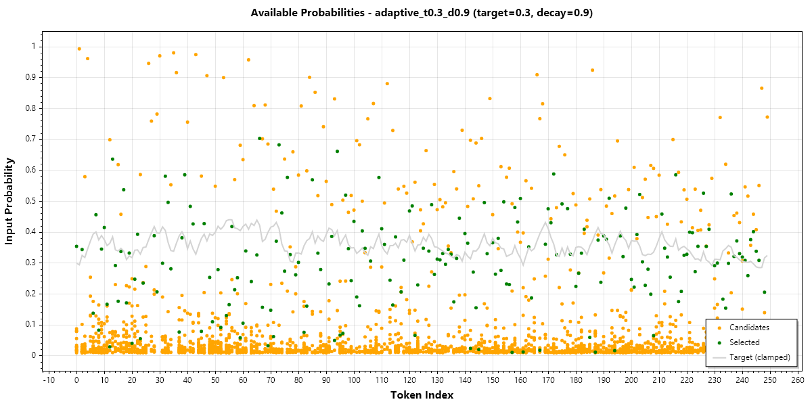<br><em>Target 0.3: Selections cluster around 0.3–0.4, avoiding high-probability tokens.</em></td>
<td width="50%">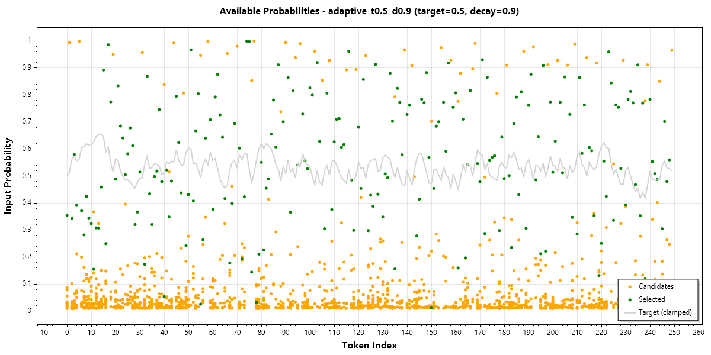<br><em>Target 0.5: Selections favor mid-range (0.5–0.7).</em></td>
</tr>
<tr>
<td width="50%">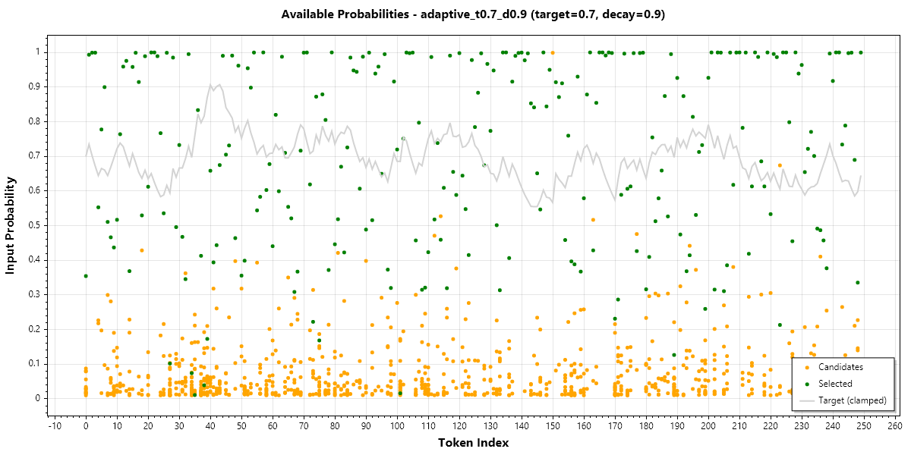<br><em>Target 0.7: Selections shift toward 0.7–1.0.</em></td>
<td width="50%">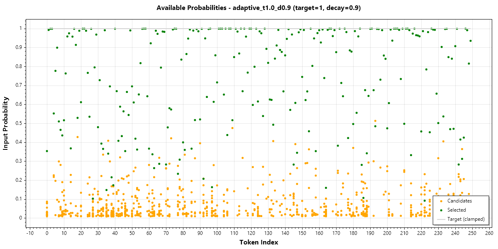<br><em>Target 1.0: Nearly greedy—almost all at p=1.0.</em></td>
</tr>
</table>

**Interpreting the scatter:**

The scatter plots reveal the real distribution patterns discussed in Section 3.2:
- Dense horizontal line at p=1.0: forced choices (no alternative available)
- Dense cluster at low probabilities: tail tokens that exist but are rarely selected
- Green (selected) points tracking the grey target line when choices exist

## 7.2 Target Achievement Over Time

Beyond instantaneous selection patterns, we verify that the *average* selected probability converges to the configured target.

**Methodology:**

Track rolling average of selected token probabilities over generation. Compare to configured target.

After initial warmup (if any), the rolling average should stabilize near the configured target. Deviations should be symmetric—sometimes above target, sometimes below.

The following charts show calculated target over time at decay 0.5, 0.9, and 0.99 (all at target 0.5):

<table>
<tr>
<td width="50%"><br><em>Decay 0.5: Large oscillations (fishtailing).</em></td>
<td width="50%"><br><em>Decay 0.9: Balanced responsiveness.</em></td>
</tr>
<tr>
<td colspan="2" align="center" width="50%">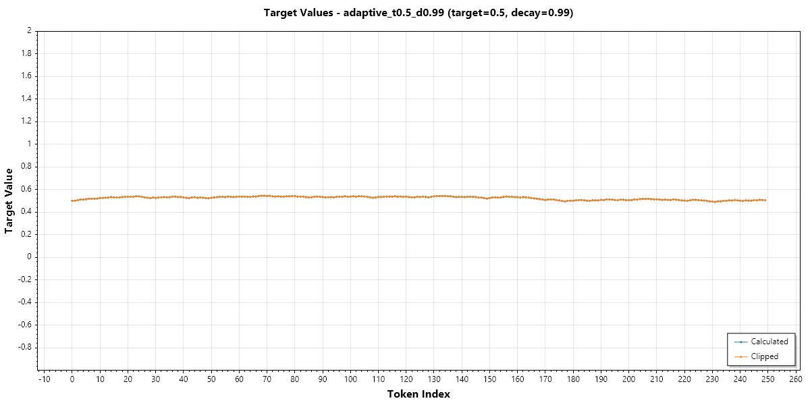<br><em>Decay 0.99: Very tight oscillations—nearly flat.</em></td>
</tr>
</table>

## 7.3 Contrast with Baseline Methods

To demonstrate Adaptive-P's unique value, we compare selection patterns against baseline sampling methods on identical input distributions.

### 7.3.1 Adaptive-P vs. Temperature

**Setup:** Same generation run, comparing target 0.5 vs. temperature 1.0 (baseline) and temperature values tuned to match Adaptive-P's entropy.

**Observation:**

Temperature produces a flat selection rate curve—tokens are selected roughly in proportion to their input probability, regardless of where that probability falls. There's no preference for mid-range tokens.

Adaptive-P produces a curved selection rate that peaks near target. Mid-range tokens are selected more often than their raw probability would suggest.

The temperature vs. Adaptive-P comparison charts in Section 2.1 demonstrate this contrast visually: temperature uniformly scales while Adaptive-P creates a distinct peak.

## 7.4 Adaptation Dynamics

We verify that the adaptive mechanism functions correctly—compensating for selection variance to maintain target average.

**Methodology:**

Track calculated target over generation. Observe response to selection patterns.

**Expected behavior:**
- After high-probability selection: calculated target drops (compensate by targeting lower)
- After low-probability selection: calculated target rises (compensate by targeting higher)
- Over time: calculated target oscillates around configured target

The decay comparison charts in Section 6.2 show this adaptation in action—decay 0.5 produces large oscillations (fishtailing), while decay 0.99 shows nearly flat targeting.

## 7.5 Initialization Validation

We verify that correct initialization prevents the warmup artifacts shown with naive initialization.

| Initialization | First 50 Tokens | Steady State |
|----------------|-----------------|--------------|
| Naive (0, 0) | Calculated target starts at configured, spikes low on first high selection, slowly recovers | Normal |
| Correct (formula) | Calculated target stable from start | Normal |

<table>
<tr>
<td width="50%"><strong>Bad initialization (naive):</strong><br><br><em>Naive init: Target drops to 0, takes ~100 tokens to recover.</em></td>
<td width="50%"><strong>Correct initialization:</strong><br><br><em>Correct init: Target stable from first token.</em></td>
</tr>
</table>

---

# 8. Implementation Reference

This section provides the complete implementation for reference and porting to other frameworks.

## 8.1 Data Structures

```cpp
struct llama_sampler_adaptive_p {
    // Configuration (immutable after init)
    float    target;          // Configured target probability
    float    decay;           // History decay rate
    uint32_t seed;            // RNG seed
    
    // Runtime state
    std::mt19937 rng;         // Random number generator
    float weighted_sum;       // Running weighted sum of selected probabilities
    float total_weight;       // Running sum of weights
    
    // Temporary storage (per-step)
    std::vector<float> original_probs;  // Original probabilities before transform
};
```

## 8.2 Constants

```cpp
#define PEAK_LOGIT_VALUE    5.0f    // Maximum logit for on-target tokens
#define SHARPNESS           10.0f   // Transformation curve steepness
#define DISTRIBUTION_WIDTH  0.2f    // Probability distance scaling
#define INV_WIDTH           (1.0f / DISTRIBUTION_WIDTH)  // Precomputed inverse
```

## 8.3 Initialization

```cpp
struct llama_sampler * llama_sampler_init_adaptive_p(
    float target, 
    float decay, 
    uint32_t seed
) {
    auto seed_cur = get_rng_seed(seed);
    float clamped_decay = std::clamp(decay, 0.0f, 0.99f);
    
    return llama_sampler_init(
        &llama_sampler_adaptive_p_i,
        new llama_sampler_adaptive_p{
            /* .target         = */ target,
            /* .decay          = */ clamped_decay,
            /* .seed           = */ seed_cur,
            /* .rng            = */ std::mt19937(seed_cur),
            // Correct initialization: prime as if target already achieved
            /* .weighted_sum   = */ target / (1.0f - clamped_decay),
            /* .total_weight   = */ 1.0f / (1.0f - clamped_decay),
            /* .original_probs = */ {},
        });
}
```

**Critical:** The weighted_sum and total_weight initialization prevents warmup artifacts. Starting at (0, 0) would cause the calculated target to spike low on first high-probability selection.

## 8.4 Core Algorithm

```cpp
static void llama_sampler_adaptive_p_apply(
    struct llama_sampler * smpl, 
    llama_token_data_array * cur_p
) {
    auto * ctx = (llama_sampler_adaptive_p *) smpl->ctx;

    // ===== SECTION 1: Disabled check =====
    if (ctx->target < 0.0f) {
        // Negative target = disabled
        // Sample from unmodified distribution
        llama_sampler_softmax_impl(cur_p, false);
        cur_p->selected = llama_sample_dist(cur_p, ctx->rng);
        return;
    }

    // ===== SECTION 2: Store original probabilities =====
    // Apply softmax to get current probabilities
    llama_sampler_softmax_impl(cur_p, false);
    
    // Save for history update later
    ctx->original_probs.resize(cur_p->size);
    for (size_t i = 0; i < cur_p->size; ++i) {
        ctx->original_probs[i] = cur_p->data[i].p;
    }

    // ===== SECTION 3: Compute adapted target =====
    auto target = std::clamp(ctx->target, 0.0f, 1.0f);
    
    float adapted_target_raw = ctx->total_weight == 0.0f 
        ? target 
        : 2.0f * target - (ctx->weighted_sum / ctx->total_weight);
    
    float adapted_target = std::clamp(adapted_target_raw, 0.0f, 1.0f);

    // ===== SECTION 4: Apply transformation =====
    for (size_t i = 0; i < cur_p->size; ++i) {
        // Distance from target, scaled
        float dist = std::abs(
            (cur_p->data[i].p - adapted_target) * INV_WIDTH
        );
        
        // Unbounded quadratic transformation
        cur_p->data[i].logit = PEAK_LOGIT_VALUE 
            - SHARPNESS * dist * dist / (1.0f + dist);
    }

    // ===== SECTION 5: Sample from transformed distribution =====
    llama_sampler_softmax_impl(cur_p, false);
    const int idx = llama_sample_dist(cur_p, ctx->rng);
    cur_p->selected = idx;

    // ===== SECTION 6: Update history =====
    // Use ORIGINAL probability of selected token
    ctx->weighted_sum = ctx->original_probs[idx] 
        + ctx->decay * ctx->weighted_sum;
    ctx->total_weight = 1.0f 
        + ctx->decay * ctx->total_weight;
}
```

## 8.5 Supporting Functions

**Softmax implementation** (typical):

```cpp
static void llama_sampler_softmax_impl(
    llama_token_data_array * cur_p, 
    bool use_temperature
) {
    float max_logit = -INFINITY;
    for (size_t i = 0; i < cur_p->size; ++i) {
        max_logit = std::max(max_logit, cur_p->data[i].logit);
    }
    
    float sum = 0.0f;
    for (size_t i = 0; i < cur_p->size; ++i) {
        cur_p->data[i].p = expf(cur_p->data[i].logit - max_logit);
        sum += cur_p->data[i].p;
    }
    
    for (size_t i = 0; i < cur_p->size; ++i) {
        cur_p->data[i].p /= sum;
    }
}
```

**Sampling function** (typical):

```cpp
static int llama_sample_dist(
    llama_token_data_array * cur_p, 
    std::mt19937 & rng
) {
    std::uniform_real_distribution<float> dist(0.0f, 1.0f);
    float r = dist(rng);
    
    float cumsum = 0.0f;
    for (size_t i = 0; i < cur_p->size; ++i) {
        cumsum += cur_p->data[i].p;
        if (r <= cumsum) {
            return i;
        }
    }
    return cur_p->size - 1;  // Fallback
}
```

## 8.6 Reset and Clone

For proper sampler lifecycle management:

```cpp
static void llama_sampler_adaptive_p_reset(struct llama_sampler * smpl) {
    auto * ctx = (llama_sampler_adaptive_p *) smpl->ctx;
    
    // Reset to initial state (as if freshly initialized)
    float clamped_decay = std::clamp(ctx->decay, 0.0f, 0.99f);
    ctx->weighted_sum = ctx->target / (1.0f - clamped_decay);
    ctx->total_weight = 1.0f / (1.0f - clamped_decay);
    
    // Re-seed RNG
    ctx->rng = std::mt19937(ctx->seed);
}

static struct llama_sampler * llama_sampler_adaptive_p_clone(
    const struct llama_sampler * smpl
) {
    const auto * ctx = (const llama_sampler_adaptive_p *) smpl->ctx;
    return llama_sampler_init_adaptive_p(ctx->target, ctx->decay, ctx->seed);
}
```

---

# 9. Conclusion

## 9.1 Summary

We have presented Adaptive-P, an alternative sampling method for autoregressive language models that introduces probability targeting as an alternative to traditional truncation and scaling approaches.

**The problem addressed:**

High-confidence token chains produce repetitive, generic output. Once a model commits to a common phrase pattern, each subsequent token reinforces the chain. Standard sampling methods—temperature and truncation—don't provide a mechanism to prefer mid-range probabilities over the dominant choice.

**The solution:**

Adaptive-P applies a distance-based transformation that preferentially selects tokens near a user-specified target probability. The transformation uses:
- Quadratic core for fine differentiation among close candidates
- Linear tails for unbounded suppression of distant tokens
- Adaptive adjustment to maintain target average over time

**Key properties:**
1. **Direct targeting:** Users specify the desired probability range, not an abstract "temperature" value
2. **Chain breaking:** Consecutive high-confidence selections trigger adaptive compensation, making alternatives more attractive
3. **No fat tails:** Unlike XTC-style redistribution, probability concentrates on near-target tokens rather than spreading to garbage


## 9.2 Contributions

This work offers the following:

1. **Paradigm:** Probability targeting as a principled alternative to truncation-based sampling. Rather than asking "which tokens should we keep?" we ask "which probability range should we prefer?"

2. **Algorithm:** The specific transformation design—unbounded quadratic with adaptive history—that makes probability targeting work on real token distributions with their sparse, clustered characteristics.

3. **Integration:** Clear guidance on sampler chain positioning and interaction with existing methods, particularly the complementary relationship with min-p.

4. **Validation:** Empirical demonstration that Adaptive-P achieves its targeting goal across varied models and prompts.

## 9.3 Limitations

**Adaptive-P cannot create diversity that doesn't exist.** If a model's distribution has only one viable token (p ≈ 1.0), or all candidates are far from target, the sampler cannot manufacture mid-range options. It operates on available candidates.

**Sharp distributions limit effectiveness.** Heavily instruction-tuned models with peaked distributions show less dramatic effects from Adaptive-P compared to base models with spread distributions.

**Parameter tuning still required.** While "target" is more intuitive than "temperature," users must still learn what probability range produces their desired output quality. The default (0.5) works well for many cases but isn't universal.

## 9.4 Future Work

**Adaptive constants:** The current SHARPNESS value (10.0) was empirically tuned. Automatic tuning based on input distribution characteristics could improve robustness.

**Multi-token lookahead:** Current implementation considers only the immediate selection. Considering how the selection affects future distributions could enable longer-term coherence optimization.

**Integrated quality metrics:** Coupling Adaptive-P with perplexity or coherence scoring could allow dynamic target adjustment based on output quality rather than purely probability-based feedback.

**Broader framework support:** Current implementation targets llama.cpp. Ports to vLLM, Hugging Face Transformers, and other popular frameworks would increase accessibility.

## 9.5 Availability

Adaptive-P is implemented in llama.cpp and available via PR to the main repository. Source code and documentation are provided under permissive license.

---

## Acknowledgments

This work wouldn't exist without the following contributors from the BeaverAI community for their invaluable assistance:

- **mfunlimited** — Created and maintained the llama.cpp mainline PR (#17927), ported the C# implementation to C++, iterated through multiple algorithm versions, and coordinated with upstream maintainers
- **concedo** — Identified the long tail issue with the original Lorentzian formula, collaborated on deriving the correct initialization formula (`target / (1 - decay)`), validated mathematical correctness, and implemented the sampler in KoboldCpp
- **aessedai** — Created and maintained the SillyTavern fork with sampler support, hosted test APIs for community testing, and created Docker images for RunPod deployment
- **geechan** — Community coordination, documentation planning, opened the ik_llama feature request, and organized testing efforts across models

Special thanks to the broader llama.cpp community for their continued development of accessible LLM inference tooling.

> [!NOTE]
> **AI Disclosure:** This documentation was written with the assistance of AI language models. However, the Adaptive-P algorithm, its mathematical formulation, empirical validation, and all technical contributions presented in this paper are the original work of the author and human collaborators listed above. AI was used solely as a writing aid for documentation purposes.

---

## References

[1] **Holtzman, A., Buys, J., Du, L., Forbes, M., & Choi, Y.** (2020). *The Curious Case of Neural Text Degeneration.* International Conference on Learning Representations (ICLR). arXiv:1904.09751.
> Introduced **nucleus sampling (top-p)**, showing that maximization-based decoding leads to degenerate text and proposing dynamic truncation of the probability distribution.

[2] **Fan, A., Lewis, M., & Dauphin, Y.** (2018). *Hierarchical Neural Story Generation.* Proceedings of the 56th Annual Meeting of the Association for Computational Linguistics (ACL).
> Introduced **top-k sampling** for neural text generation, demonstrating improved diversity over beam search for creative writing tasks.

[3] **Basu, S., Ramachandran, G. S., Keskar, N. S., & Varshney, L. R.** (2021). *Mirostat: A Neural Text Decoding Algorithm that Directly Controls Perplexity.* International Conference on Learning Representations (ICLR). arXiv:2007.14966.
> Introduced **Mirostat**, which dynamically adjusts top-k to maintain target perplexity. This work was the original inspiration for Adaptive-P's probability targeting approach.

[4] **Nguyen, M. N., Baker, A., Neo, C., Roush, A., Kirsch, A., & Shwartz-Ziv, R.** (2025). *Turning Up the Heat: Min-p Sampling for Creative and Coherent LLM Outputs.* International Conference on Learning Representations (ICLR). arXiv:2407.01082.
> Introduced **min-p sampling**, which dynamically sets a probability threshold relative to the top token. Min-p serves as a complementary guardrail to Adaptive-P.

[5] **Hinton, G., Vinyals, O., & Dean, J.** (2015). *Distilling the Knowledge in a Neural Network.* arXiv:1503.02531.
> Introduced softmax **temperature scaling** for knowledge distillation, establishing the foundational mechanism used by temperature sampling in language models.

[6] **Ackley, D. H., Hinton, G. E., & Sejnowski, T. J.** (1985). *A Learning Algorithm for Boltzmann Machines.* Cognitive Science, 9(1), 147-169.
> Early work on **stochastic sampling** with temperature in neural networks, establishing the temperature parameter's role in controlling exploration-exploitation tradeoffs.


---

## Appendix: Sample Outputs

The following sample outputs are referenced throughout the documentation. Click on any sample link above to jump to that section.

<a id="sample-target-0.3-sample"></a>

### Target 0.3 Sample

# Sample Generation: Target 0.3 (Creative)

**Prompt:** "Write me a three paragraph horror story about a haunted bath-house written in the first person"

**Settings:**
- Target: 0.3
- Decay: 0.9
- Model: GLM-4.5-Air-Q4_K_M
- Samplers: top_k, min_p, adaptive_p

---

The air inside the Old Stearns Bathhouse hangs thick with dampness and something else – the sour, cloying smell of stagnant water and old pipe resin that seems to coat your lungs like a cold slime. My guide’s cheerful warnings about ‘quirks of old buildings’ feel flimsy the moment he vanishes behind a curtain of steam near the men's section, leaving only the relentless hiss of dripping faucets and the low groan of the ancient pipes. The vast tiled room stretches into gloomy shadow beyond the circle of weak, buzzing overhead lights. Steam clings to my skin like cold, damp cobwebs as I edge towards a lone empty bench near a cracked porcelain tub. It feels too silent here, too still.

A sudden, violent clatter echoes from somewhere deeper in the bath-house – metal clattering on stone. I jump, my heart thudding a heavy drumbeat against my ribs. “Hello?” The word hangs, swallowed by the steam without a response, yet another drip begins somewhere close, impossibly close to where I stand. Then I hear it, a low whispering sound woven into the hissing of steam – a voiceless murmur like damp rags being shuffled over tiles, just at the edge of hearing, right behind my back. My blood turns to icy slurry as a cold draft, utterly impossible in the humid heat, sweeps over the nape of my neck.

Panic floods my system as I spin towards the whisper, but the bench where I’d sat is suddenly empty. Instead, standing where the empty tub was, a shape forms within the densest steam – the faint outline of a hunched figure, dripping dark water that stains the grey tiles black around its formless feet. The hissing whisper intensifies into a sibilant chuckle, directly in my ear. The last thing I see is a swirling cloud of steam condensing on my own arm into the wet, icy fingerprints of something that was never there. Then, the cold darkness wraps around me like a drowning sheet.


---

<a id="sample-target-0.5-sample"></a>

### Target 0.5 Sample

# Sample Generation: Target 0.5 (Balanced)

**Prompt:** "Write me a three paragraph horror story about a haunted bath-house written in the first person"

**Settings:**
- Target: 0.5
- Decay: 0.9
- Model: GLM-4.5-Air-Q4_K_M
- Samplers: top_k, min_p, adaptive_p

---

The first time I saw it, I dismissed the whispers as just the old pipes settling, the sighs of the ancient steam system. But the bath-house, with its tiled walls stained dark by decades of moisture, held a deeper chill the air itself couldn't account for. The water, once clear and inviting, now felt thin and cold against my skin even as the steam rose, carrying the scent of mildew and something older, like wet earth disturbed after a long burial. Shadows clung to the corners of the vast changing room, refusing to yield completely even under the flickering fluorescent lights overhead. That’s when the whispers started again, not from the pipes this time, but from the empty cubicles beside me, low and wet and sounding like voices drowning in deep water.

The second visit was worse. The steam was unnaturally dense, clinging like a wet shroud and muffling the world outside. I could feel eyes on my back in the steam-filled pool, not just the imagined stares of other patrons, but a focused, ancient malevolence that seemed to seep from the damp tiles. The water rippled without a breeze, the surface disturbed by something unseen just below, dark and shapeless. I caught fleeting glimpses in the foggy mirrors – distorted figures that dissolved when I blinked, leaving only a lingering impression of decay and hollow eyes. A cold spot, unnaturally so, formed directly beneath me in the water, making me gasp as my own warmth was sucked away, replaced by something that felt distinctly like a touch.

I fled the third time. The whispers had become a chorus of drowned pleas, rising and falling like the tide in the tiled chamber. As I scrambled out of the main pool, dripping and shaking, I saw them: faint, wet handprints pressed against the glass of the sauna door from the inside. They hadn’t been there when I entered. Then came the sound, not from outside, but from within my own mind, clear and cold: *"You belong here now. The water remembers."* The lock clicked shut on the sauna door with a final, echoing thud. Through the frosted glass, a shape began to coalesce in the dense, white steam, a silhouette too tall, too gaunt to be human. The water in the drain beside my feet began to bubble darkly, as if pulling something up from the depths below.


---

<a id="sample-target-0.7-sample"></a>

### Target 0.7 Sample

# Sample Generation: Target 0.7 (Conservative)

**Prompt:** "Write me a three paragraph horror story about a haunted bath-house written in the first person"

**Settings:**
- Target: 0.7
- Decay: 0.9
- Model: GLM-4.5-Air-Q4_K_M
- Samplers: top_k, min_p, adaptive_p

---

The steam always hangs too thick in the old bathhouse, a suffocating blanket that clings to your skin even before you step into the water. I came seeking the quiet, the heat, the way the old place seemed to swallow your thoughts whole. The tiles are cracked and stained, the air thick with the ghosts of a hundred other bathers, their sighs echoing in the tiled chamber. I lowered myself into the largest pool, the water unnervingly still, its surface like dark glass reflecting only the warped ceiling beams and the dim, flickering bulb overhead. For a moment, it was just me, the heat, and the oppressive silence broken only by the distant drip of water from a rusted pipe.

Then, something brushed my ankle beneath the surface. Not a stray leaf or a piece of debris, but something solid, cold, and deliberate. I froze, heart hammering against my ribs, straining to see through the murky water. Nothing moved. The steam swirled, obscuring the edges of the pool. I told myself it was just the current, my own imagination playing tricks in the heat. But then, it happened again, higher this time, a cold, bony touch sliding up my calf, leaving a trail of goosebites that felt like frost. A low, gurgling sigh seemed to rise from the drain itself, a sound that wasn't water, but something ancient and drowned.

I scrambled out of the pool, water streaming from my body, my breath coming in ragged gasps. The air felt suddenly frigid, the steam retreating as if fleeing from me. I grabbed my towel, my hands shaking, and backed towards the changing room. As I fumbled with the lock, I glanced back at the empty pool. The surface was perfectly still again, but the water looked darker, deeper, somehow *hungrier*. And beneath the surface, just for a second, I thought I saw a shape, pale and distorted, rising from the depths, its eyes fixed on me. I slammed the door shut, leaning against it, the cold wood a poor shield against the certainty that I wasn't alone, and that the bathhouse had claimed another bather for its silent, steamy depths.


---

<a id="sample-target-0.9-sample"></a>

### Target 0.9 Sample

# Sample Generation: Target 0.9 (Near-deterministic)

**Prompt:** "Write me a three paragraph horror story about a haunted bath-house written in the first person"

**Settings:**
- Target: 0.9
- Decay: 0.9
- Model: GLM-4.5-Air-Q4_K_M
- Samplers: top_k, min_p, adaptive_p

---

The steam hit me first, thick and cloying, smelling of damp stone and something else… something faintly sweet, like rotting flowers. I’d ignored the warnings, the locals’ nervous glances towards the old bath-house perched on the cliff edge. It was supposed to be abandoned, but the promise of solitude, of the ancient mineral springs, was too tempting. The changing rooms were skeletal, wood groaning under my weight. Stepping into the main pool chamber, the air was unnervingly still, the only sound the slow, rhythmic *drip… drip… drip* from a cracked pipe high above. The water itself was unnervingly warm, almost too hot, but I sank into it anyway, the mineral-rich liquid clinging to my skin like a second layer. That’s when I felt the first shift – not a current, but a *presence*, a subtle thickening of the water around my ankles, as if something vast and ancient was stirring beneath the surface.

The steam began to coalesce, twisting into shapes that weren’t quite human, figures with elongated limbs and featureless faces that dissolved back into mist the moment I tried to focus. A whisper slithered through the humid air, not words, but a feeling, a cold dread that seeped into my bones despite the heat. "Leave," it seemed to sigh, the sound vibrating through the water itself. I told myself it was just the acoustics, the old plumbing playing tricks. But then the temperature plummeted, not gradually, but in a sudden, shocking wave that made my teeth chatter. The water felt… *wrong*. It wasn’t cold; it was *hungry*. It pressed against me with a new weight, a thousand tiny, insistent hands pulling me down, deeper into the suffocating embrace of the pool. The dripping stopped. The silence became absolute, broken only by the frantic hammering of my own heart against my ribs.

Panic finally clawed its way through the fog of denial. I tried to push myself up, but the water resisted, thick as oil, clinging to me like a lover’s desperate grip. The steam swirled violently, forming a vortex directly above me, and in its center, I saw it – not a face, but an absence of light, a void that pulsed with a cold, ancient hunger. The whisper returned, louder this time, a chorus of voices woven from the stone and the water itself: *Stay. Rest. Become one.* The drain at the bottom of the pool glistened, not with reflected light, but with a wet, organic sheen, and it seemed to *breathe*, opening and closing like a slow, deliberate mouth. The water wasn’t just haunted; it was *alive*, and it had decided I was its next meal. I screamed, but the sound was swallowed whole by the suffocating steam and the endless, hungry dark.


---

<a id="sample-target-0-no-minp"></a>

### Target 0 No Minp

# Target 0.1 WITHOUT Min-P

**Settings:** `--adaptive-target 0.1 --adaptive-decay 0.9` (no min-p filtering)

**Prompt:** *"Write a 5 paragraph story about a talking dog that doesn't believe animals can talk."*

---

In Sunnygroodock Village  
By Sunny Groodies, June threesti—Snygrove (pron  
ounced two things). Oh wait

June Threeeti, Sna Groedoe ( pronounced sneah grow doe?
But they've spelled and pronoimceed as June Thrist,
Groenidk in previous articles  
Okay,

Dear Village Chronic
A baffll 
by the Talking Labrador Who Th animals
Who Wouldn Talk—Let Call It Baxter
 bafflig incident Unveilers in Sonogrod
Dale where Baxter is one dog
that refuses ak knowledge  
to accept that an

alright—I feel this can work but please rewrite using clearer instructions next—
 Okay then. here

The headline would scream a small scandal of a sort. It was not about illicit cheese tasting, late nights out fetch games; nothing remotely resembling excitement that

---

<a id="sample-target-0-with-minp"></a>

### Target 0 With Minp

# Target 0 WITH Min-P 0.05

**Settings:** `--min-p 0.03 --adaptive-target 0.1 --adaptive-decay 0.9`

**Prompt:** *"Write a 5 paragraph story about a talking dog that doesn't believe animals can talk."*

---

Barney wasn’t just a terrier with scruffy ears; Barney was a walking, balking contradiction. Every morning, as he munched on kibble in Mrs. Henderson’s kitchen, he’d narrate his inner thoughts in surprisingly clear, human cadences, lamenting the crunchiness or questioning the flavor choices. “Honestly,” he’d mutter one sunny morning, peering out the back window where the neighborhood squirrel chattered, “Silly little critters, running about chattering away like that. Probably dreaming up trouble, just making noises.” Barney could hold lengthy discussions with his boy, Leo, about everything from the indignity of bath-time to the injustice of shared pizza toppings lacking crusts. Yet, if any other animal – from Mrs. Henderson’s Siamese, Percy, who occasionally meowed sharp questions at the mail slot, to Leo’s pet budgie, Pip, who warbled nonsensical dittles – seemed capable of articulate sound, Barney would simply snort, flicking his tail. “That’s not talking, that’s just... well, barking and meowing! Proper communication? Humans talking to me, now *that’s* the civilized world.” The concept that other creatures possessed anything close to his unique skill, the very essence of his special status in his own eyes, was utterly laughable. It wasn't ignorance; it was a fervently maintained delusion.

Leo found his dog's hypocrisy both adorable and bewildering. One afternoon, Pip landed on the windowsill outside where Barney lay, beady head tilted. Pip’s complex whistled song seemed, to Barney, an insult to conversational integrity. “Pipe down, you feathery annoyance,” Barney growled, without opening his eyes. Leo couldn't help himself: “He sounds almost annoyed at us, doesn’t he?” Barney snapped one open. “Don’t be ridiculous, Leo! It’s a bird! All they do is flap wings and squawk. Talking is about expressing complex thoughts and needs. Birds have neither!” Leo would just smile, ruffling Barney’s fur, marveling that his best friend couldn't connect his own ability with anything resembling an animal instinct.

Barney’s certainty began to crack under pressure from a newcomer across the alley – a grumpy bulldog named Gus who rarely moved but whose barking was unusually targeted and gravelly, often managing to comment directly on passing children’s loud sneakers. When Gus started demanding specific types of biscuits in mumbled growls directed at Mrs. Peterson (“The round ones! *Rounds!*, I say!”), Barney would pace near the fence, tail twitching furiously. “Pure chance,” Barney huffed to himself one day after Gus clearly asked, then received, the desired round biscuits via an obligating throw from his owner. “Coincidence. Gus probably smells differently when Mrs. Peterson reaches the biscuit tin!” Barney desperately searched for human-style reasoning everywhere else but his own, extraordinary mirror. To consider Gus capable of *intent*, let alone language, threatened the fragile framework where *Barney* was the singular talking dog in creation, an honorary member of humanity.

The dam burst, not dramatically, but through quiet observation. Percy, Siamese philosopher and nap enthusiast, often gazed thoughtfully into space from the living room cushion. Percy never *barked*. His voice, a deep rumbling purr or an inquisitive trill, sounded distinctly feline, undoglike, to Barney’s critical ears. Then one day, left alone in the sunbeam-filled living room after Percy’s bowl appeared unexpectedly empty, Barney watched intently as Percy approached Mrs. Henderson’s reclining figure, stretched out elegantly beside her leg, and let loose a low, questioning, remarkably sustained trill followed by a distinct “Puhrr?” Mrs. Henderson murmured something inaudible and refilled Percy’s bowl instantly, placing the fresh bowl before the cat who had just emitted those peculiar, deliberate sounds. A dawning realization washed over Barney colder than the tile floor: Percy *asked* for his meal in that unmistakably communicative sound, just like Leo’s request for a biscuit meant something different than Leo saying he wanted water.

Later, lying under his familiar desk near the boy he cherished, Leo reading aloud with comforting rhythm, Barney looked over at Pip now meticulously arranging seeds. Pip stopped, glanced directly at Leo’s voice, then piped a rapid series of notes, one higher-pitched, almost like a questioning whistle, that sounded utterly foreign compared to the earlier nonsense song. Leo glanced at Pip. “All right, buddy,” he sighed softly, reaching up. Pip nimbly landed on Leo’s shoulder. “Yeah, yeah, you’ll get a treat when the reading’s over,” Leo murmured to the bird, who gave an almost smug-looking ruffle. A slow, stunned realization crept into Barney’s canine heart, displacing decades of denial. If Pip *could* be understood… and Gus could make his preferences clear... then surely… if he could understand humans and articulate thoughts, maybe, just maybe... others had always understood each other? Maybe, buried under all those barks, growls, purrs, and warbles, lay languages just as valid and real as the voice inside him that only he truly knew. His belief was gone, leaving him not less, but somehow paradoxically smaller within an unexpectedly vast and quietly conversant animal kingdom he had finally noticed, sitting right beside him on his favorite cushion.


---
