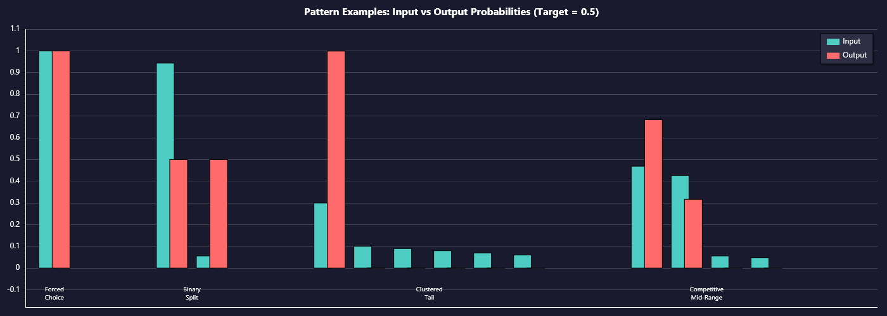

# 3. The Adaptive-P Algorithm

This section presents the complete algorithm, starting with conceptual foundations and building to implementation details.

## 3.1 Core Concept: Probability Targeting

The fundamental question Adaptive-P answers is not "which tokens are most likely?" but rather "which tokens occupy a specific probability range?"

Consider a token distribution where:
- Token A has probability 0.60
- Token B has probability 0.25  
- Token C has probability 0.10
- Token D has probability 0.05

Standard sampling will select Token A roughly 60% of the time. But what if we want to encourage selection of tokens in the 0.2–0.4 probability range—tokens the model considers "plausible but not dominant"?

Adaptive-P addresses this by applying a bell-curve transformation centered on the target probability. If target is 0.3, Token B (at 0.25) becomes favored over Token A (at 0.60), even though Token A started with higher probability.


*Illustrative of transformation function only—real token distributions are sparse/clustered.*

## 3.2 Real Distribution Behavior

In practice, candidate pools after min-p filtering show characteristic patterns rather than smooth distributions. Understanding these patterns is essential to understanding why Adaptive-P's specific transformation design matters.

### Pattern A: Forced Choice

**Example:** A distribution with a single token at probability 1.0.

When only one token survives min-p filtering, the sampler has no choice. Adaptive-P passes through—the single token is selected regardless of its probability relative to target.

**Implication:** Adaptive-P cannot create choices that don't exist. It operates on the candidates provided by earlier pipeline stages.

**Effect on adaptive target:** The forced selection (probability 1.0) is recorded in history. If the configured target is 0.5, this high selection pushes the calculated target lower on subsequent steps—the sampler will compensate by preferring lower-probability options when choices become available again.

### Pattern B: Binary Split

**Example:** Two candidates—one at 0.94, one at 0.06.

Two candidates with a large probability gap. Both are viable (passed min-p), but one strongly dominates.

**Effect:** If target is 0.5, neither token is close. The 0.94 token is 0.44 away from target; the 0.06 token is also 0.44 away. Because they're nearly equidistant from target, the transformation produces nearly equal output probabilities—despite starting with a 94% vs 6% split. The underdog's post-transform probability rises to roughly 50%.

This is the chain-breaking mechanism in action. A high-confidence token followed by another high-confidence prediction gets disrupted because the target-adjustment favors alternatives.

### Pattern C: Clustered Tail

**Example:** One token at 0.30, plus 20+ tokens clustered between 0.01–0.10.

One mid-range leader with a cluster of low-probability alternatives. This is where the transformation's tail behavior matters most.

**The clustering problem:** If transformation applies a floor (e.g., minimum logit of 0), all 20 tail tokens hit that floor after softmax. Each gets exp(0) = 1.0 relative score. Twenty tokens times 1.0 = 20.0 cumulative score. The leader at 0.30 might have logit 5.0, so exp(5.0) ≈ 148. Ratio: 148 / (148 + 20) ≈ 88% for leader, 12% for entire tail.

That 12% split across 20 tokens seems okay, but imagine 100 tail tokens: now it's 148 / (148 + 100) ≈ 60% leader, 40% tail—significant garbage probability.

**Adaptive-P's solution:** Unbounded negative logits. Each additional unit of distance from target produces another unit of negative logit, which translates to another order of magnitude less probability after softmax. The cluster never accumulates mass.

### Pattern D: Competitive Mid-Range

**Example from samples:** "serene/river" → `token 21748: 0.469` vs `token 14785: 0.427`

Two tokens close in probability, both reasonably near target. This is where the quadratic core of the transformation matters.

**Effect:** The quadratic shape provides fine differentiation between close candidates. A token at distance 0.02 from target gets a noticeably different logit than one at distance 0.08, allowing the sampler to express graduated preference rather than treating all near-target tokens identically.



## 3.3 Configured Target vs. Calculated Target

Adaptive-P maintains a distinction between what the user requests and what the algorithm targets on each step:

- **Configured Target:** User-specified desired average probability (e.g., 0.5)
- **Calculated Target:** Per-token adjusted value based on selection history

The calculated target adapts based on a weighted moving average of previously selected token probabilities:

```
weighted_average = weighted_sum / total_weight
calculated_target = 2.0 × configured_target − weighted_average
```

**Intuition:** If recent selections averaged 0.6 probability but the user wants 0.5, the calculated target drops to 0.4 to compensate. The algorithm "aims past" the configured target to pull the average back toward it.

**In practice:** Calculated targets typically vary by about 2% around the configured target (e.g., 0.48–0.52 when configured at 0.5). This small variation shows the adaptation in action—compensating for natural selection variance to maintain the desired average. See Section 7.2 for charts showing this behavior at different decay values.

The calculated target is clamped to [0.0, 1.0] before use. Extreme historical selections can push the raw calculated value outside this range, but the clamping ensures the transformation remains well-defined.

> [!NOTE]
> Theoretically, an unclamped target could produce stronger logit differentiation—tokens within the [0,1] range would have more extreme logit differences due to greater distance from the unclamped value. In practice this provides little benefit: high-probability tokens can't cluster (there's only so much probability to go around), and low-probability tokens are already so close together in probability space as to be effectively indistinguishable.

## 3.4 The Logit Transformation

The heart of Adaptive-P is a transformation applied to each token's logit based on its probability's distance from the calculated target:

```cpp
float dist = std::abs((cur_p->data[i].p - adapted_target) * INV_WIDTH);
cur_p->data[i].logit = PEAK_LOGIT_VALUE - SHARPNESS * dist * dist / (1.0f + dist);
```

Breaking this down:

1. **Distance calculation:** `|probability - target| × INV_WIDTH`
   - Absolute distance from target, scaled by inverse distribution width
   - INV_WIDTH (1/0.2 = 5.0) amplifies distance for sharper discrimination

2. **Transformation:** `PEAK − SHARPNESS × dist² / (1 + dist)`
   - PEAK_LOGIT_VALUE (5.0): Maximum logit for tokens exactly at target
   - SHARPNESS (10.0): Controls curve steepness
   - The `dist² / (1 + dist)` term is the key: quadratic near zero, linear at distance

**Why this specific form?**

The `dist² / (1 + dist)` function has critical properties:

- **Near target (dist → 0):** Behaves like `dist²` (quadratic). Small differences in distance produce proportionally small differences in logit. This allows fine discrimination among close competitors.

- **Far from target (dist → ∞):** Behaves like `dist` (linear). Each additional unit of distance subtracts another unit from the logit. This is the "unbounded negative" property that prevents tail accumulation.

- **Transition region:** Smooth interpolation between behaviors. No discontinuities or kinks.


**Why not a floor-based transformation?**

A transformation with a minimum logit floor (e.g., one that asymptotically approaches zero) would cause all distant tokens to converge toward the same value, enabling the cluster accumulation problem described next.

## 3.5 Why Unbounded Negative Logits Matter

This section addresses the clustering problem in detail, as it's the key insight that drove the algorithm design.

**The setup:** Consider a distribution with 26 candidates ranging from 0.01 to 0.11 probability, none close to target 0.5.

**With a logit floor (bounded transformation):**
- All 26 tokens are far from target
- All receive approximately the minimum logit (let's say 0.0)
- After softmax: each gets exp(0) = 1.0 relative weight
- Total weight: 26.0
- Each token probability: 1/26 ≈ 3.8%

**With unbounded negative (Adaptive-P):**
- Closest token (0.11 probability) gets logit ≈ 3.0
- Next closest gets logit ≈ 2.5
- Distant tokens get logits of -5, -10, -15...
- After softmax: exp(3.0) ≈ 20, exp(2.5) ≈ 12, exp(-10) ≈ 0.00005
- Distant tokens contribute essentially zero probability

The practical difference:
- Floor-based: 26 tokens share probability approximately evenly
- Adaptive-P: Top 2-3 tokens dominate; rest are effectively excluded

This is the "selective redistribution" property. Probability doesn't flow uniformly to all candidates—it concentrates on those closest to target.

The XTC comparison charts in Section 2.5 illustrate this directly: XTC's uniform redistribution boosts all tail tokens (green lines up), while Adaptive-P concentrates probability on near-target tokens and suppresses the tail (red lines down).

## 3.6 Softmax Normalization

The transformation outputs raw logit values. Softmax converts these to probabilities:

```
probability[i] = exp(logit[i]) / Σ exp(logit[j])
```

**Key property:** Relative differences between logits matter, not absolute values. Adding a constant C to all logits doesn't change probabilities:

```
exp(logit + C) / Σ exp(logit_j + C)  =  exp(C) × exp(logit) / (exp(C) × Σ exp(logit_j))  =  exp(logit) / Σ exp(logit_j)
```

The exp(C) terms cancel out.

This means PEAK_LOGIT_VALUE (5.0) is somewhat arbitrary—what matters is the *difference* between peak and suppressed logits.

**Interaction with tail behavior:**

Softmax's exponential nature amplifies the unbounded negative property. A logit difference of 10 produces a probability ratio of exp(10) ≈ 22,000. Very distant tokens become negligible contributors even without explicit removal.


## 3.7 History State and Initialization

Adaptive-P maintains two state variables across token selections:

- **weighted_sum:** Running sum of selected token probabilities, decayed
- **total_weight:** Running sum of weight values, decayed

Updated after each selection:
```cpp
weighted_sum = original_probs[selected_idx] + decay × weighted_sum
total_weight = 1.0 + decay × total_weight
```

**The initialization problem:**

If weighted_sum and total_weight start at 0, the first calculated target becomes:
```
calculated_target = 2.0 × target − (0 / 0)  // undefined!
```

The code handles the 0/0 case by using the configured target directly. But this creates a transient: early selections have no history to compensate, so the sampler behaves differently during warmup.

**Correct initialization:**

Initialize as if the configured target had already been achieved:
```cpp
weighted_sum = target / (1.0 - decay)
total_weight = 1.0 / (1.0 - decay)
```

For target=0.5, decay=0.9:
- weighted_sum = 0.5 / 0.1 = 5.0
- total_weight = 1.0 / 0.1 = 10.0
- weighted_average = 5.0 / 10.0 = 0.5 ✓

This primes the history as if infinitely many tokens at the target probability had been selected, providing stable behavior from the first token.

<table>
<tr>
<td width="50%"><strong>Bad initialization (naive):</strong><br><br><em>Naive init: Target drops to 0, takes ~100 tokens to recover.</em></td>
<td width="50%"><strong>Correct initialization:</strong><br><br><em>Correct init: Target stable from first token.</em></td>
</tr>
</table>
