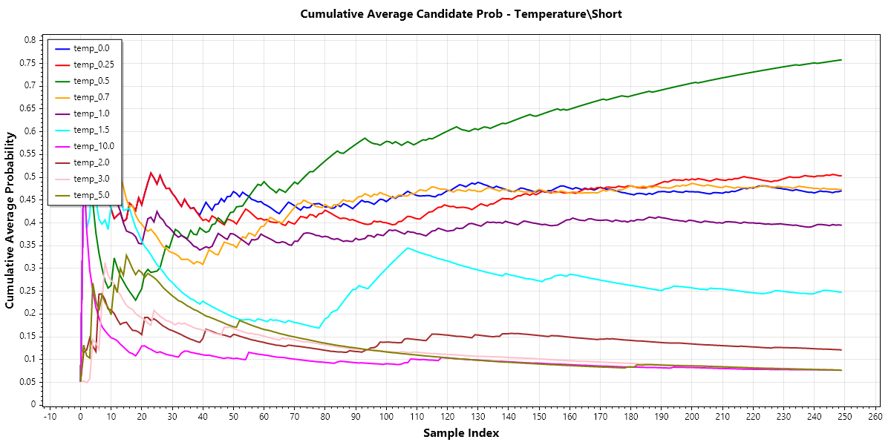
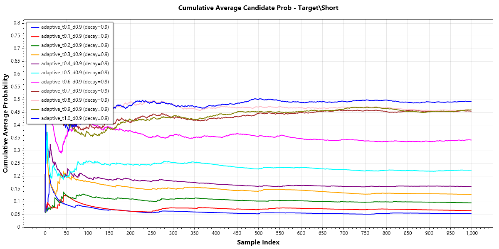

# 6. Empirical Validation

This section presents empirical evidence that Adaptive-P achieves its design goals: successfully targeting specified probability ranges while maintaining output quality.

## 6.1 Selection Distribution Analysis

The primary claim of Adaptive-P is that it targets specific probability ranges. We validate this by analyzing selection patterns over large generation runs.

**Methodology:**

Generate 25,000+ tokens across varied prompts with Adaptive-P at target 0.5, decay 0.9. For each token selection, record:
- Input probability (from original distribution)
- Whether this token was selected
- Post-transform probability (from Adaptive-P distribution)
- Calculated target at this step

Selection frequency should peak near the target probability. Tokens at input probability 0.5 should be selected more often than tokens at 0.2 or 0.8.

The following scatter plots show selection behavior at different target values. Orange dots are available candidates; green dots are selected tokens; grey line is the calculated (clamped) target.

*Target 0.3: Selections cluster around 0.3–0.4, consistently avoiding high-probability tokens even when available.*

*Target 0.5: Selections favor the mid-range (0.5–0.7), with the calculated target oscillating around 0.55.*

*Target 0.7: Selections shift toward high-probability tokens (0.7–1.0), often selecting the most likely candidate.*

*Target 1.0: Nearly greedy behavior—almost all selections at p=1.0. Functionally equivalent to temperature 0.*

**Interpreting the scatter:**

The scatter plots reveal the real distribution patterns discussed in Section 3.2:
- Dense horizontal line at p=1.0: forced choices (no alternative available)
- Dense cluster at low probabilities: tail tokens that exist but are rarely selected
- Green (selected) points tracking the grey target line when choices exist

## 6.2 Target Achievement Over Time

Beyond instantaneous selection patterns, we verify that the *average* selected probability converges to the configured target.

**Methodology:**

Track rolling average of selected token probabilities over generation. Compare to configured target.

After initial warmup (if any), the rolling average should stabilize near the configured target. Deviations should be symmetric—sometimes above target, sometimes below.

The following charts show calculated target over time at decay 0.5, 0.9, and 0.99 (all at target 0.5):

*Decay 0.5: Large oscillations (0.3–0.8 range). The sampler reacts strongly to recent selections, causing fishtailing behavior.*

*Decay 0.9 (default): Moderate oscillations (0.45–0.65 range). Balanced responsiveness—tracks toward target without overcorrecting.*

*Decay 0.99: Very tight oscillations (0.48–0.55 range). Almost flat—long history window dampens all variation.*

## 6.3 Contrast with Baseline Methods

To demonstrate Adaptive-P's unique value, we compare selection patterns against baseline sampling methods on identical input distributions.

### 6.3.1 Adaptive-P vs. Temperature

**Setup:** Same generation run, comparing target 0.5 vs. temperature 1.0 (baseline) and temperature values tuned to match Adaptive-P's entropy.

**Observation:**

Temperature produces a flat selection rate curve—tokens are selected roughly in proportion to their input probability, regardless of where that probability falls. There's no preference for mid-range tokens.

Adaptive-P produces a curved selection rate that peaks near target. Mid-range tokens are selected more often than their raw probability would suggest.

The temperature vs. Adaptive-P comparison charts in Section 2.1 demonstrate this contrast visually: temperature uniformly scales while Adaptive-P creates a distinct peak.

## 6.4 Adaptation Dynamics

We verify that the adaptive mechanism functions correctly—compensating for selection variance to maintain target average.

**Methodology:**

Track calculated target over generation. Observe response to selection patterns.

**Expected behavior:**
- After high-probability selection: calculated target drops (compensate by targeting lower)
- After low-probability selection: calculated target rises (compensate by targeting higher)
- Over time: calculated target oscillates around configured target

The decay comparison charts in Section 6.2 show this adaptation in action—decay 0.5 produces large oscillations (fishtailing), while decay 0.99 shows nearly flat targeting.

## 6.5 Initialization Validation

We verify that correct initialization prevents the warmup artifacts shown with naive initialization.

| Initialization | First 50 Tokens | Steady State |
|----------------|-----------------|--------------|
| Naive (0, 0) | Calculated target starts at configured, spikes low on first high selection, slowly recovers | Normal |
| Correct (formula) | Calculated target stable from start | Normal |

**Bad initialization (naive):**

*With naive initialization (weighted_sum=0, total_weight=0), the first high-probability selection causes a massive overcorrection. The calculated target drops to nearly 0, then spends ~100 tokens slowly recovering to the configured 0.5.*

**Correct initialization:**

*With correct initialization (using the formula from Section 3.7), the calculated target oscillates stably around 0.5 from the very first token. No warmup period required.*

## 6.6 Cross-Model Consistency

A key claim is that target 0.5 produces similar behavior across different models. We validate this with comparative analysis.

**Models tested:**
- Llama family (7B, 13B)
- Mistral (7B)  
- GLM-4 variant

**Metric:** Selection rate distribution shape at target 0.5

**Expected result:**

All models show peaked selection rate near 0.5. The peak height may vary (models with flatter distributions allow more mid-range selection), but the *location* of the peak should be consistent.

> **Graph [G-23]: Cross-Model Selection Patterns**  
> *Overlay selection rate curves from different models at same target. Show peak locations align.*

<!-- TODO: G-23 cross-model data
  @claude: Requires multi-model runs. Lower priority.
  @loxifi: 
-->

## 6.7 Generation Stability Over Time

> [!NOTE]
> This phenomenon is observed empirically but not fully understood. The following is a working hypothesis based on testing and theoretical analysis.

An unexpected benefit of Adaptive-P is improved generation stability over extended outputs. The cumulative average probability of selected tokens remains stable throughout generation, while temperature sampling shows continuous drift.

**Temperature Sampling:**

*Cumulative average probability drifts continuously. Low temperatures (red, green) trend upward over 250 samples. The model enters feedback loops where probability extremes compound.*

**Adaptive-P:**

*Cumulative average stabilizes after ~50 tokens and maintains that level through 1000+ samples. Each target level finds its equilibrium and holds it.*

### Why This Matters

During the Llama 2 era, extensive testing revealed that models inevitably drift toward either:
- **Repetition (boredom):** High-probability selections lead to boring context, which produces more boring token distributions
- **Incoherence (confusion):** Low-probability selections lead to confused context, which produces more chaotic distributions

This drift occurs even with "equal" sampling (temperature 1.0) due to pure RNG effects. It's analogous to driving without hands on the wheel—no matter how straight the initial alignment, random noise eventually causes drift.

### Hypothesized Mechanism

**The feedback loop (temperature):**
1. RNG selects a slightly unusual token
2. This unusual token enters context
3. Context now contains slight noise
4. Model produces distribution slightly more peaked or flat than baseline
5. Selection from this distribution reinforces the drift
6. Repeat until context degradation becomes noticeable

**The counterforce (Adaptive-P):**
1. Target forces consideration of mid-range tokens
2. If recent selections were high-probability ("boring"), calculated target drops
3. This steers next selection toward lower-probability alternatives
4. If selections were low-probability ("confused"), target rises
5. The elastic mechanism actively resists accumulation of probability extremes

### Alternative Explanations

This stability might also arise from:
- **Distribution regularization:** The transformation produces more consistent post-softmax distributions regardless of input shape
- **Selection diversity:** Higher token selection variance prevents repetitive context patterns that trigger model-internal feedback loops
- **Entropy maintenance:** By maintaining broader effective candidate pools, Adaptive-P avoids the low-entropy death spiral

Further research is needed to isolate the causal mechanism.
